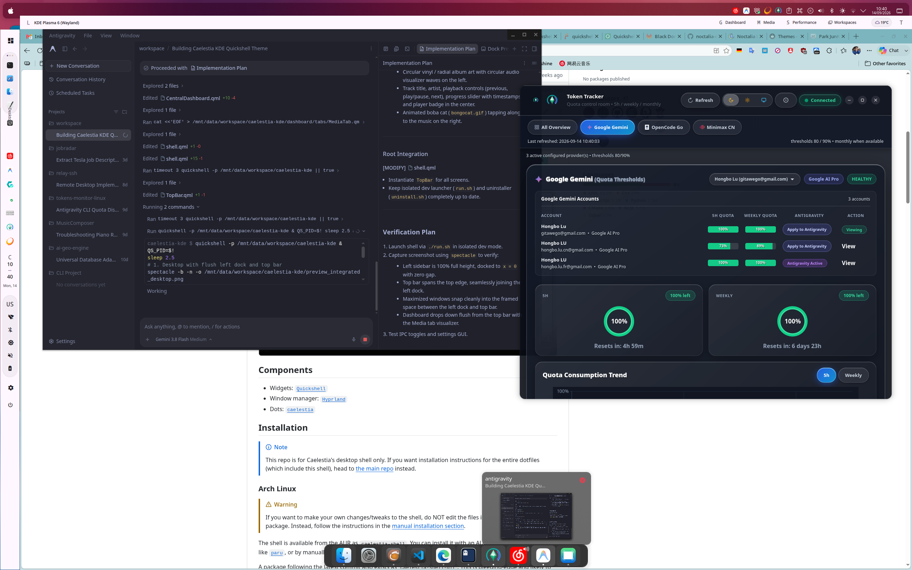
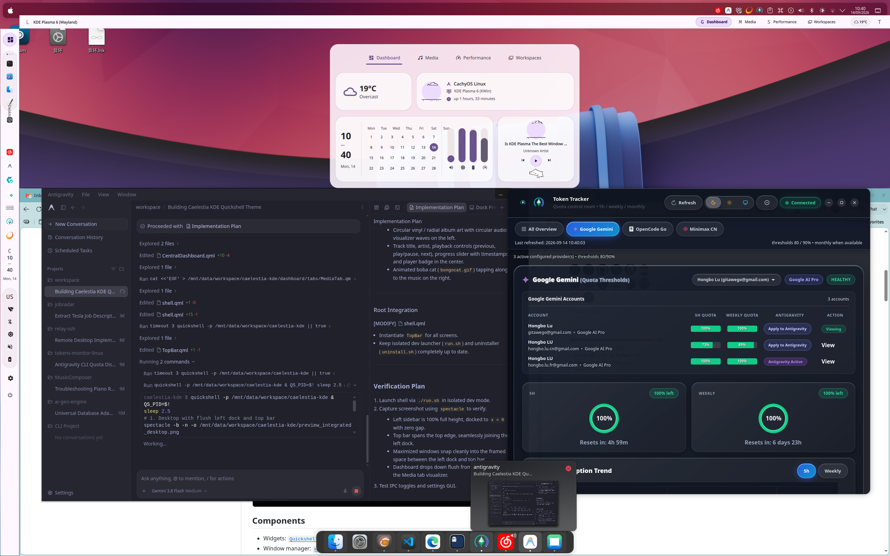

# Astral Plasma

> A sleek, fluid, and multi-theme modern desktop shell for **KDE Plasma 6 & KWin**, built with [Quickshell](https://quickshell.outfoxxed.me/) and QtQuick.

[](https://kde.org/plasma-desktop/)
[](https://quickshell.outfoxxed.me/)
[](https://opensource.org/licenses/MIT)

---

## 🌟 Overview & Inspiration

**Astral Plasma** is an extensible desktop shell engineered specifically for **KDE Plasma 6** and **KWin**. 

While the default visual language is **highly inspired by [caelestia-dots/shell](https://github.com/caelestia-dots/shell)** (bringing its elegant seamless desktop frame, soft shadows, and fluid morphing popouts to KDE), Astral Plasma is designed as a **general-purpose, multi-theme shell framework**. It is not restricted to any single theme and can easily be styled and themed to fit any desktop aesthetic.

---

## ✨ Features

- **Seamless Desktop Border & Frame**:
  - Full-screen outer boundary with smooth rounded corners and elegant, soft shadows.
  - Seamless window integration with zero gaps or misplaced drop shadows.
- **Adaptive Left Dock**:
  - **Launcher & Workspaces**: Quick application launcher and KWin virtual desktop indicator with animated glyphs (crescent moon, square, circle, dot).
  - **Active Window Tracker**: Centered current application name and icon with seamless 90° typography.
  - **Live Dynamic Taskbar**: Displays real running applications across KWin with click-to-focus and active accent pill indicators.
  - **System Tray**: Native DBus `StatusNotifierItem` integration with context menus and activate actions.
  - **Stacked Clock & Status Pill**: Clean vertical clock paired with quick indicators for Wi-Fi, Bluetooth, power profiles, and system power.
- **Fused Morphing Popouts**:
  - Popouts seamlessly expand out from the dock's status pill with soft shadows and fluid transitions.
  - Quick access to power management, Wi-Fi networks, Bluetooth devices, and battery statistics.
- **Central Integrated Dashboard**:
  - Fullscreen / overlay dashboard with music controls, media progress, quick toggles, notifications, and weather info.
- **Retina & HiDPI Optimized**:
  - Proportional typography and pixel-perfect icon scaling designed for modern high-DPI (180–220+ DPI) screens.
- **Dynamic Multi-Theming & Material You**:
  - Extensible theming engine supporting Material You / [matugen](https://github.com/InioX/matugen) dynamic color extraction from your active KDE wallpaper, with built-in pastel and custom palettes.

---

## 📸 Screenshots

| Integrated Desktop & Border | Central Dashboard |
| :---: | :---: |
|  |  |

---

## 📋 Prerequisites

- **OS**: Linux with **KDE Plasma 6**
- **Window Manager**: KWin (Wayland or X11)
- **Dependencies**:
  - [`quickshell`](https://quickshell.outfoxxed.me/) (v0.3.0+)
  - `qt6-base`, `qt6-declarative`, `qt6-svg` (Qt 6.6+)
  - `qdbus6` (standard in Plasma 6)
  - `pipewire` / `pw-record` (Audio & visualizer)
  - `fcitx5` / `fcitx5-remote` (optional, for IME switcher)
  - `power-profiles-daemon` / `powerprofilesctl` (optional, for power profiles)
  - `matugen` (optional, for dynamic wallpaper palette extraction)
  - `spectacle` (optional, for screenshots / debugging)

> 💡 **Automated Dependency Doctor**: You can verify all dependencies, versions, and system readiness at any time:
> ```bash
> make doctor
> # or directly via binary:
> ./bin/astral-plasma doctor
> # or machine-readable JSON:
> ./bin/astral-plasma doctor --json
> ```

---

## 🚀 Getting Started

### 1. Safe Dev Mode (Recommended to test first)
Run the shell in isolation without modifying your system's quickshell configuration:

```bash
git clone https://github.com/gitawego/astral-plasma.git
cd astral-plasma
./run.sh
```

*Press `Ctrl+C` in the terminal to stop at any time.*

### 2. System Installation
To install as your primary Quickshell configuration:

```bash
./install.sh
```

This will:
- Back up any existing `~/.config/quickshell` to `~/.config/quickshell.backup`.
- Symlink this repository to `~/.config/quickshell`.
- Install desktop shortcuts in `~/.local/share/applications`.
- Generate the initial color palette.

Launch anytime via:
```bash
quickshell
```

### 3. Uninstall
To remove the symlink and restore your previous configuration:
```bash
./uninstall.sh
```

---

## ⌨️ IPC & Shortcuts

You can trigger UI popouts and panels via Quickshell IPC commands or bind them to custom global keyboard shortcuts in KDE:

| Action | IPC Command / Script |
| :--- | :--- |
| **Open Power Popout** | `quickshell -p ~/.config/quickshell ipc call popout open power` |
| **Open Network Popout** | `quickshell -p ~/.config/quickshell ipc call popout open network` |
| **Open Bluetooth Popout** | `quickshell -p ~/.config/quickshell ipc call popout open bluetooth` |
| **Close Popout** | `quickshell -p ~/.config/quickshell ipc call popout close` |
| **Toggle Dashboard** | `~/.config/quickshell/scripts/toggle_dashboard.sh` |
| **Toggle Settings** | `~/.config/quickshell/scripts/toggle_settings.sh` |

---

## 🎨 Customization & Multi-Theming

Configuration files are located in `config/` and `theme/`:
- `config/settings.json`: shipped default settings (dock width, margin, top bar, status icons, dashboard tabs). Your live settings live in `~/.config/astral-plasma/settings.json` and are the only file the shell writes.
- `theme/Theme.qml`: Typography scale, corner radius, borders, and shadows.
- `theme/Colors.qml`: Active color tokens. Easily plug in new color schemes or theme profiles.

---

## 📄 License & Credits

- The initial design language is highly inspired by the work of [caelestia-dots/shell](https://github.com/caelestia-dots/shell).
- Licensed under the [MIT License](LICENSE).
