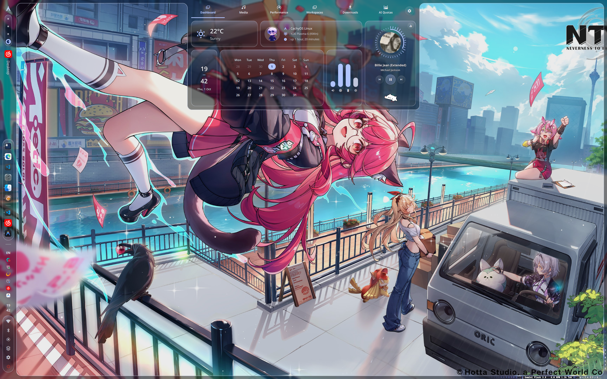
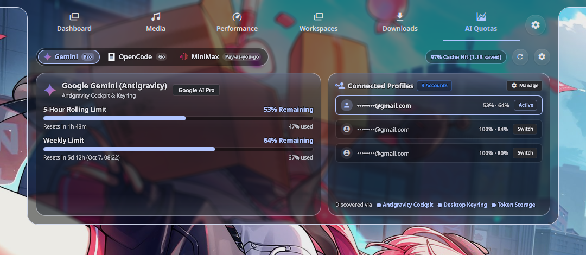
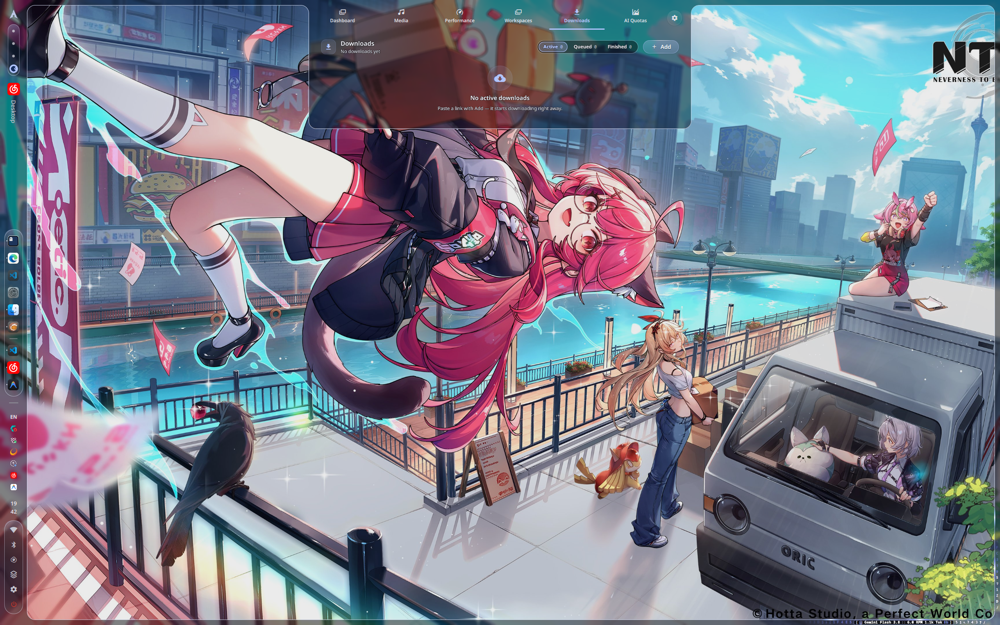
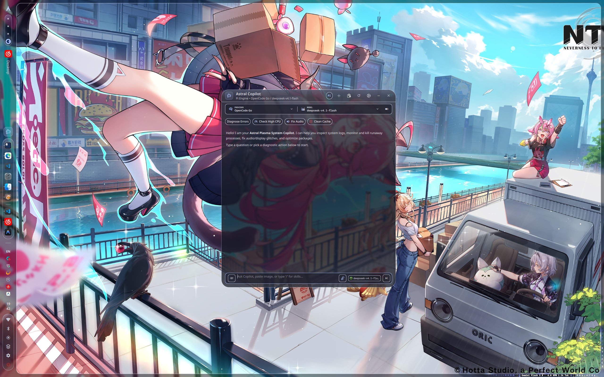
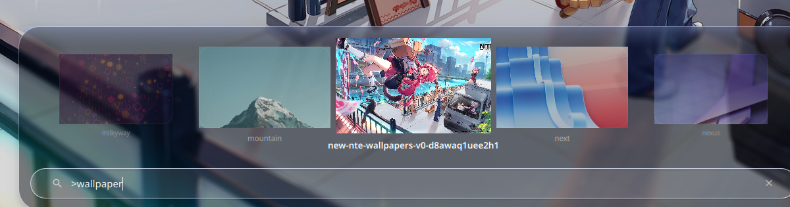

# Astral Plasma

> A sleek, fluid, and multi-theme modern desktop shell for **KDE Plasma 6 & KWin** and **Hyprland / Omarchy**, built with [Quickshell](https://quickshell.outfoxxed.me/), QtQuick, and a native **Rust daemon**.

[](https://kde.org/plasma-desktop/)
[](https://hyprland.org/)
[](https://omarchy.org/)
[](https://quickshell.outfoxxed.me/)
[](https://www.rust-lang.org/)
[](https://opensource.org/licenses/MIT)

---

<p align="center">
  
</p>

## 📸 Screenshots

| AI Quotas & Telemetry Dashboard | Central Overview Dashboard |
| :---: | :---: |
|  |  |

| Downloads Manager | AI Copilot Chat Window |
| :---: | :---: |
|  |  |

<p align="center">
  
  <br />
  <em>Interactive Wallpaper Picker & Carousel — Liquid Glass floating previews with Material You palette generation</em>
</p>

---

## 🌟 Overview & Inspiration

**Astral Plasma** is an extensible desktop shell engineered for **KDE Plasma 6 (KWin)**, **Hyprland**, and hosted **Omarchy** plugin environments.

The visual language is **highly inspired by [caelestia-dots/shell](https://github.com/caelestia-dots/shell)** — its seamless desktop frame, soft shadows, and fluid morphing popouts — while the architecture is a general-purpose, multi-theme shell framework: a Quickshell/QML frontend layered on top of a self-contained Rust daemon with a ports-and-adapters architecture.

### Architecture

```
┌─────────────────────────────────────────────────────────────┐
│  QML Presentation (Quickshell)                              │
│  shell.qml · DesktopSessionFacade · UnifiedShell · Dock     │
│  dashboard/ · settings_gui/ · dock/ · services/ · theme/    │
└──────────────────────────┬──────────────────────────────────┘
                           │ Quickshell IPC · Unix Socket Stream
┌──────────────────────────▼──────────────────────────────────┐
│  Rust Daemon  (bin/astral-plasma, DDD layers)               │
│  domain/ (DesktopSessionSnapshot · Workspace · Window)      │
│  infrastructure/ (KWinAdapter · HyprlandAdapter · DBus)     │
│  window previews · metrics · wallpaper · shortcuts · doctor │
└─────────────────────────────────────────────────────────────┘
```

The daemon builds into a **single self-contained binary** (`bin/astral-plasma`) that embeds the entire QML theme bundle and Omarchy plugin assets, runs the shell, exposes a REST/Unix-socket API, and manages Plasma panels, Hyprland socket events, shortcuts, and system diagnostics.

---

## ✨ Features

### Unified Desktop Surface
- **Seamless outer frame**: full-screen boundary with rounded corners, soft shadows, zero gaps, and concentric inner fillets (`CornerFillet`).
- **Flush fused left dock + top bar**: `UnifiedDock` and `TopBar` share one `FusedPanel` surface with liquid-glass material and true compositor blur (`BackgroundEffect.blurRegion`, KWin blur radius tuned by `run.sh`).
- **Invisible exclusion zones** (`ExclusionZones`): 1px strips that reserve screen edges for KWin window tiling.
- **Wallpaper layer**: dynamic + static background layers with live preview, carousel picker, and Material You palette regeneration via [matugen](https://github.com/InioX/matugen).

### Left Dock
- **Launcher & workspaces**: quick launcher entry with animated workspace indicators and liquid asymmetric pill transitions (500ms/750ms decoupled edges).
- **Live taskbar** (`DockTaskbar`): running KWin windows, click-to-focus, scroll-capped (`DockScrollCapsule`) so it never pushes dock controls off-screen.
- **Active window tracker**: centered app name/icon with context menu.
- **System tray**: native `StatusNotifierItem` DBus integration with context menus (`TrayContextMenu`) and click-to-activate.
- **Stacked clock & status icons**: clock plus keyboard layout, network, Bluetooth, brightness, audio, and battery indicators (order/enabled via settings).
- **Fused bottom popouts**: `FusedBottomPopout` morphs out of the dock for Audio, Battery, Bluetooth, Brightness, Keyboard layout, Wi-Fi, tray menus, and app previews.

### Surfaces & Overlays
- **Central dashboard** (`CentralDropdown`): dropdown overlay with configurable tabs — **Dashboard** (weather, system host card, clock, calendar, quick sliders, media controls), **Media**, **Performance** (system metrics), **Workspaces**, **Downloads** (aria2 manager), and **AI Quotas** (multi-provider tokens & rolling limits).
- **AI Copilot** (`AssistantWindow`): floating Liquid Glass desktop copilot with multi-model arbitration (OpenCode Go, Gemini, DeepSeek), quick system diagnostics, and voice transcription.
- **Command launcher** (`CommandLauncher`): bottom search/launch modal with keyboard navigation and an integrated **wallpaper carousel**.
- **Active apps overview** (`ActiveAppsOverview`): fullscreen overlay on bare `Meta` (KWin shortcut → daemon → shell IPC) showing **live window thumbnails** captured through KWin's `ScreenShot2` API, with double-buffered flicker-free updates.
- **Volume OSD**, **right-edge control rail**, **power confirmation dialog**, and **notification popups**.
- **Settings GUI** (`settings_gui/`): in-shell settings window with a Nexus hub and pages for Dock, Dashboard, Theme, Wallpaper & Style, Audio, Bluetooth, Network, Status icons, and System.

### 🤖 AI Copilot & Telemetry Ecosystem
Astral Plasma features a native, liquid-glass AI suite engineered for proactive system self-healing, multi-model chat, and live quota monitoring:

- **Astral Copilot (`AssistantWindow`)**:
  - **Floating Liquid Glass Surface**: Wayland compositor-integrated floating copilot with Material 3 Expressive spring physics, adaptive sizing, and true backdrop blur.
  - **Multi-Model Arbitration**: Seamless runtime switching between providers (**OpenCode Go**, **Google Gemini**, **MiniMax**, **DeepSeek**, **Claude**, **OpenAI**) and models (`deepseek-v4.1-flash`, `gemini-2.5-pro`, `mimo-v2.6-flash`, etc.).
  - **Agent Harness Integration**: Pluggable backend architecture supporting CLI agent runtimes including **Pi Agent** (`pi`) and **Hermes**.
  - **One-Click Diagnostic Actions**: Instant triage pills built into the prompt bar — *Diagnose Errors*, *Check High CPU*, *Fix Audio Glitches*, and *Clean Cache*.
  - **Proactive Crash Carousel**: Daemon crash monitor hooks process termination signals (`SIGSEGV`, `SIGABRT`) in real time, displaying a dismissible multi-crash carousel with a 1-click *Debug* workflow that passes stack traces directly to the Copilot.
  - **Vision & Multi-Modal Input**: Attach local files, images, or instant desktop screenshots to inspect UI glitches and logs visually.
  - **Whisper Voice Dictation**: Local speech-to-text dictation with Silero VAD, PipeWire noise suppression, and echo cancellation.
  - **Session Management**: Full chat session drawer with history navigation and fast new-chat instantiation.

- **AI Quotas & Rate Limits Dashboard (`AiTab`)**:
  - **Rolling Quota Tracking**: Live telemetry tracking for 5-hour rolling limits and weekly quotas with visual progress bars, percentage readouts, and exact countdown timers (*"Resets in 1h 43m"*).
  - **Prompt Cache Efficiency**: Monitors global token cache hit rates (e.g. 97% cache hit, 1.1B cached tokens saved).
  - **Multi-Account Switching & Privacy Masking**: Switch between multiple Gemini/provider profiles on the fly with built-in privacy masking (`••••••••@gmail.com`) to prevent leaking sensitive email addresses during screencasts and presentations.
  - **Zero-Config Agent Discovery**: Automatically scans and synchronizes credentials from Antigravity Cockpit, Desktop Keyring, Pi Agent (`~/.pi/agent`), and OpenCode (`~/.config/opencode`).

- **Dynamic AI Dock Pill & Popout (`AiPill` & `AiTokensSection`)**:
  - Live dock pill reactively pulses with token streaming rate, active model identity, and request load.
  - Color-coded threshold alerts (warning at 80%, critical at 95%) that notify you before rate limits are exhausted.
  - Morphing dock popout for quick quota status and one-click account switching.

#### Pi harness updates

The Copilot's engine is the user's own **pi** installation. Astral never pins,
bundles or downgrades it — it probes what is installed and reports it everywhere
(`assistant status`, **Settings → AI → Pi Harness**, `doctor`).

**Settings → AI → Pi Harness** updates it without leaving the shell: the card
shows the installed version and offers *Update Pi* (`pi update self`), *Update
packages* (`pi update --extensions`) and *Refresh model catalogs*
(`pi update --models`), reporting the version it moved between — or pi's own
output when nothing was a version change. A machine without pi is offered the
install command instead. The same three targets are scriptable:

```bash
astral-plasma assistant update-pi                 # pi itself  (Settings → AI → Update Pi)
astral-plasma assistant update-pi --extensions    # installed packages
astral-plasma assistant update-pi --models        # model catalogs
astral-plasma doctor                              # "Pi Agent (AI Copilot harness): pi <version> ..."
astral-plasma assistant status                    # machine-readable: harness version, path, skills
```

The equivalent by hand is `pi update` / `pi update --extensions` /
`pi update --models` (or `npm i -g @earendil-works/pi-coding-agent@latest`).

What Astral relies on, and therefore checks after an upgrade:

| contract | how it is used |
|---|---|
| `pi -p <prompt> --mode json` | one turn per invocation; the JSONL stream is parsed for text deltas, tool calls and errors |
| `--provider` **only with** `--model` | pi 1.0 fails a run whose provider has no model, so a lone provider is omitted (pi then uses `defaultProvider` from its settings, which Astral keeps in sync) |
| `--skill <dir>` | the same `~/.agents/skills` the user has |
| `pi mcp --help` | built-in MCP, required since 0.99 (the legacy `pi-mcp-adapter` must not be installed) |
| `packages` in `~/.pi/agent/settings.json` | `pi-subagents` provisioning; both the string and `{ "source": … }` entry shapes are read |
| `defaultProvider` / `defaultModel` | written so a bare `pi` run uses the model chosen in the shell |

The floor is **0.99.0** (built-in MCP); 1.x is the tested line. Below the floor,
`doctor` reports a warning with the update command — never an error, because the
Copilot is optional. The pi contract itself is pinned by
`daemon/tests/test_assistant_harness.rs`, including a captured pi 1.0 JSON stream.

### 📥 Integrated Downloads Manager (Aria2 Engine)
A dedicated, fluid download manager embedded directly inside the Central Dashboard:

- **Native Aria2 RPC Integration**: Connects to the local `aria2c` JSON-RPC daemon (`localhost:6800`) with zero polling overhead and reactive state synchronization.
- **Segmented Filter Control**: Material 3 segmented pill bar toggling between **Active**, **Queued**, and **Finished** tasks with live count badges.
- **Per-Download Split & Thread Tuning**: Slide-over sheet allows overriding connection splits (1 to 16 parallel threads per file) before dispatching downloads.
- **Clipboard Auto-Detection**: Instant URL capture from clipboard with automatic Wayland keyboard focus delegation when opening the add-URL sheet.
- **Bounded Liquid Glass Cards**: Height-clamped, scrolling list container (`maxListHeight`) prevents tall lists from stretching off-screen; includes real-time speedometers, progress bars, and file management actions (Pause, Resume, Remove, Open Folder).
- **Graceful Empty States**: Designed glass placeholders for all segments when no tasks are queued.

**Settings → Downloads** owns the engine: destination folder, connections per download, parallel downloads, a global speed cap (0 = unlimited) and the border HUD. The engine-wide values are pushed to the running `aria2c` (`changeGlobalOption`), so a change applies to downloads already queued instead of on the next restart.

**Optional engine, explicit consent.** aria2 is not required for a healthy shell. When it is missing the Downloads tab is *not* shown in the dashboard (its setting is remembered and applies as soon as the engine exists), and the settings pages say so instead of failing silently. Either page offers to install it through the desktop's own authentication dialog (`pkexec` → the KDE polkit prompt, nothing is installed without your confirmation) or copies the distribution's install command for a terminal. `astral-plasma doctor` reports the same state as an optional warning, and `astral-plasma downloads engine-status` / `install-engine` expose it to scripts.

### Media
- **Multi-player MPRIS**: adapters for Spotify, NetEase Cloud Music, QQ Music, and a generic/universal fallback, with player switching.
- **Real-time visualizers**: PipeWire DSP spectrum via the daemon (`astral-plasma visualizer`) driving `radial`, `speaker`, and `heatmap` styles — energy is ground-truth PCM data, silence reads exactly `0.0`.
- **Audio stream arbitration**: per-app PipeWire stream matching for volume routing.

### Theming
- **Dynamic Material You / matugen** palette extraction from your KDE wallpaper, plus built-in presets (default `iris`) and light/dark modes.
- **Design tokens**: all motion uses the Material 3 Expressive beziers and durations from [`DESIGN.md`](DESIGN.md) / `theme/Theme.qml` — no hardcoded durations.

### Backend (Rust Daemon)
- DDD layout: `domain/` · `application/` · `infrastructure/` · `interfaces/`.
- Owns DBus integrations (KWin workspaces, Plasma panels, tray, MPRIS), system metrics parsing, window previews, wallpaper persistence, shortcut binding, systemd user-service management, and an interactive **dependency doctor**.
- Embedded QML bundle (`astral-plasma extract`), REST + Unix-socket API server (`astral-plasma serve`), and an event-driven watcher.

---

## 📋 Prerequisites

- **Desktop Environments Supported**:
  - **KDE Plasma 6** & KWin (Wayland or X11)
  - **Hyprland** (v0.50.0+ Wayland)
  - **Omarchy** (v4.0.x hosted plugin mode under `omarchy-shell`)
- **Runtime dependencies**:
  - [`quickshell`](https://quickshell.outfoxxed.me/) (v0.3.0+)
  - `qt6-base`, `qt6-declarative`, `qt6-svg` (Qt 6.6+)
  - `qdbus6` / `kwriteconfig6` (when running under KDE Plasma 6)
  - `pipewire` (audio & visualizer)
- **Build dependencies**:
  - Rust toolchain (`cargo`, stable) — builds the daemon
- **Optional**:
  - `aria2` / `aria2c` (downloads manager engine)
  - `fcitx5` / `fcitx5-remote` (IME switcher)
  - `power-profiles-daemon` / `powerprofilesctl` (power profiles)
  - `matugen` (dynamic wallpaper palette extraction)
  - `spectacle` (screenshots / visual verification)

> 💡 **Automated Dependency Doctor**: verify all dependencies, versions, and system readiness at any time:
> ```bash
> make doctor
> # or directly via the binary:
> ./bin/astral-plasma doctor
> # or machine-readable JSON:
> ./bin/astral-plasma doctor --json
> ```

---

## 🚀 Getting Started

### 1. Safe Dev Mode (recommended to test first)
Run the shell in isolation **without modifying your system's** Quickshell/Plasma configuration:

```bash
git clone https://github.com/gitawego/astral-plasma.git
cd astral-plasma
./run.sh
```

- Builds `bin/astral-plasma` on first run.
- Refuses to start a duplicate instance — if the shell is already running, `./run.sh` forwards to it over IPC.
- `./run.sh --launcher` opens the command launcher, `./run.sh --wallpaper` opens the wallpaper picker.
- Restores Plasma panels and shortcuts on exit; press `Ctrl+C` to stop safely.

### 2. Makefile workflow
```bash
make build      # Release build → bin/astral-plasma (single self-contained binary)
make run        # Build + run; auto-restores the Plasma top panel on exit
make stop       # Stop the shell and restore Plasma panels
make restore    # Restore the original KDE Plasma panels
make doctor     # Dependency / compatibility report
make test       # Full test suite: Rust unit tests + all QML suites
make clean      # Remove build artifacts
```

### 3. System installation
To install as your primary Quickshell configuration:

```bash
./install.sh
```

This will:
- Check dependencies and build the daemon.
- Back up any existing `~/.config/quickshell` and symlink this repository to it.
- Install desktop entries in `~/.local/share/applications`.
- Install the Wayland session in `~/.local/share/wayland-sessions/astral-plasma.desktop`.
- Bind global shortcuts (with a snapshot of the previous state).
- Generate the initial color palette.

Launch anytime via `./run.sh` (or `quickshell`), or select **"Astral Plasma (KWin)"** directly from your display manager (SDDM/GDM).

> 💡 **KDE Plasma & Quickshell Architecture**: For an in-depth breakdown of how Astral Plasma coordinates non-destructively with KDE Plasma 6 (`plasma-plasmashell.service`), see [docs/KDE-INTEGRATION.md](docs/KDE-INTEGRATION.md).

### 4. Uninstall
```bash
./uninstall.sh
```
Zero-residue cleanup: stops the shell, removes the user service, restores the config backup, removes the KWin script package, unbinds shortcuts, and clears data/cache/state.

### 5. Automated Releases & Pre-built Binaries (x64 / ARM64)
Astral Plasma includes an automated multi-architecture release pipeline built on GitHub Actions:
- **Supported Architectures**: `x86_64` (Intel/AMD) and `aarch64` (ARM64 / Raspberry Pi / Asahi Linux).
- **Trigger via Local Project CLI**:
  ```bash
  # Interactive mode: proposes patch, minor, major, or custom version:
  ./scripts/release.sh

  # Or explicit flags / version:
  ./scripts/release.sh --patch
  ./scripts/release.sh --minor
  ./scripts/release.sh --major
  ./scripts/release.sh 0.2.0

  # Preview with dry-run:
  ./scripts/release.sh --dry-run
  ```
- **Trigger via GitHub Actions Web UI**:
  Go to the **Actions** tab -> **Release** -> **Run workflow**:
  - **Release type**: Select `patch` (default), `minor`, `major`, or `custom`.
  - **Custom version**: Enter version only if `custom` is selected.
  - The workflow automatically increments the version, updates `daemon/Cargo.toml`, commits with `[skip ci]`, creates the annotated git tag, compiles x64 & arm64 binaries, and publishes the GitHub Release.
- Releases automatically generate a formatted Conventional Commits changelog, compile stripped binaries for both architectures, calculate cryptographic checksums (`SHA256SUMS.txt`), and publish GitHub Releases with downloadable archives and standalone binaries.

---

## ⌨️ IPC & Shortcuts

All UI surfaces are scriptable through Quickshell IPC:

```bash
quickshell ipc -p <config-path> call <target> <function> [args...]
# e.g. (installed):
quickshell ipc -p ~/.config/quickshell call dashboard toggle
# e.g. (dev checkout):
quickshell ipc -p "$PWD" call launcher open apps
```

| Target | Functions | Purpose |
| :--- | :--- | :--- |
| `dashboard` | `toggle` `open` `close` `setTab(tab)` `setDownloadsSegment(seg)` | Central dropdown dashboard (`dashboard`, `media`, `performance`, `workspaces`, `downloads`, `ai`) |
| `assistant` | `open` `close` `toggle` `newChat` `send(prompt)` `toggleVoice` `dismissCrashes` | Astral Copilot floating AI assistant window |
| `ai` | `refresh` `selectProvider(id)` `switchGemini(account)` `togglePopout` | AI token quota service & dock popout |
| `media` | `playPause` `next` `previous` `cyclePlayer` `selectPlayer(bus)` `setVisualizer(style)` `toggleVisualizer` | MPRIS media & visualizer style |
| `launcher` | `toggle` `open(mode)` `close` `next` `prev` `pageUp` `pageDown` `select(idx)` | Bottom command launcher (`apps` / `wallpaper` modes) |
| `overview` | `toggle` `open` `close` | Active apps overview (live thumbnails) |
| `settings` | `toggle` `open(page)` `close` `setPage(page)` | In-shell settings GUI |
| `theme` | `toggle` `setMode(light\|dark)` `setPreset(name)` | Theme mode / preset |
| `popout` | `toggle(mode,y)` `open(mode,y)` `close` `showTray(id)` `previewApp(idx)` | Fused bottom popouts & tray/app previews |
| `wallpaper` | `set(path)` `preview(path)` `stopPreview()` `reload()` | Wallpaper engine |
| `power` | `logout` `reboot` `shutdown` `confirm` `cancel` | Power actions with confirmation dialog |
| `notification` | `show(...)` `post(summary,body)` `dismiss()` | Notification popups |
| `rightedge` | `toggle` `open` `close` | Right-edge control rail |
| `volumeosd` | `trigger()` | Volume OSD |
| `shell` | `quit()` | Exit the shell (Plasma panels auto-restore) |

### Helper scripts (`scripts/`)

| Action | Script |
| :--- | :--- |
| Toggle dashboard | `scripts/toggle_dashboard.sh` |
| Toggle settings | `scripts/toggle_settings.sh` |
| Toggle active apps overview | `scripts/toggle_overview.sh` (or bare `Meta`, bound by `bind_shortcuts.sh`) |
| Toggle command launcher | `scripts/toggle_launcher.sh` |
| Open wallpaper picker | `scripts/open_wallpaper.sh` |
| Generate wallpaper palette | `scripts/generate_palette.sh` |
| Bind / restore global shortcuts | `scripts/bind_shortcuts.sh` / `scripts/restore_shortcuts.sh` |

### Daemon CLI (`bin/astral-plasma`)

```
run                          Run the full self-contained shell
serve [--port <port>]        REST & Unix-socket API server
extract [target_dir]         Extract the embedded QML theme bundle
session snapshot             Query canonical DesktopSessionSnapshot JSON
omarchy <install|remove|status> Manage hosted Omarchy plugin package
plasma <disable|restore|status|watchdog>
systemd <status|install|remove>
settings [toggle|open|close] Control the Settings GUI via IPC
config write <path> <json>   Atomic configuration persistence
watch                        Event-driven background watcher
visualizer                   Stream real-time audio spectrum/energy JSON
metrics                      Print system metrics JSON
calendar <resolve|open>      Open the default calendar application
workspaces <cmd>             Virtual desktops: query / switch / ensure
preview <window_id>          Capture a live window thumbnail
desktop <install|cleanup>    Manage KWin authorization desktop entries
shortcuts <backup|bind|restore|status>
tray <cmd>                   System tray operations
doctor [--json]              Diagnose all system dependencies
```

---

## 🎨 Customization & Multi-Theming

Configuration lives in `config/` and `theme/`:

- **`config/settings.json`** — shipped defaults. Top-level sections:
  `dock` (width, entries, pinned apps, tray, status icons), `dashboard` (tabs, weather, avatars), `topBar`, `theme` (mode, preset, blur strength, corner radius, dynamic colors), `border`, `plasma` (panel/notification takeover), `debugMode`, `logging` (diagnostic verbosity), `media` (visualizer style), `display` (refresh rate: 60 by default, or any target rate / `max`).
  Your live settings live in `~/.config/astral-plasma/settings.json` — the only file the shell writes (updated atomically via `astral-plasma config write`).

### Diagnostic logging

Every diagnostic line the shell prints carries a level and a category, and goes through
`services/Log.qml`. The shipped default is **`info`**: lifecycle events, warnings and errors are
visible, while the per-frame trails (`blur`, `commit`, ...) stay off until somebody asks for them.
Settings → System → *Log Verbosity* changes the level live; `logging.categories` raises a single
category on its own, which is what makes "keep the blur trail, quieten everything else" possible:

```json
"logging": { "level": "info", "categories": { "blur": "debug" } }
```

For one run, without editing a file:

```bash
ASTRAL_PLASMA_LOG_LEVEL=debug ASTRAL_PLASMA_LOG_CATEGORIES=blur=debug ./run.sh
```

Precedence (highest first): `ASTRAL_PLASMA_LOG_CATEGORIES` → `logging.categories` →
`ASTRAL_PLASMA_LOG_LEVEL` → `logging.level` → the legacy `debugMode: true` (which still shows every
trail when no level is configured) → `info`. Levels: `off < error < warn < info < debug < trace`.
The decision table is pure code in `services/Logging.js` and is asserted by `tests/tst_log_level.qml`.
- **`theme/Theme.qml`** — typography scale, corner radii, borders, shadows, and all motion tokens (M3 Expressive beziers/durations).
- **`theme/Colors.qml`** — Material Design 3 color roles and dynamic palette mappings; plug in presets or wire new schemes here.

> 📖 **[DESIGN.md](DESIGN.md)** is the source of truth for visual design & motion physics, and **[docs/LESSONS.md](docs/LESSONS.md)** documents the deep engineering: liquid-glass materials, concave shoulder fillets, zero-overlap partitioning, and blur-region coverage.

---

## 🛠️ Development & Testing

```bash
make test        # Mandatory before declaring any change done
make test-rust   # Rust unit tests (daemon/tests/)
make test-qml    # Offscreen QML suites via tests/run_qml_tests.sh
```

- **Rust**: domain models, DBus parsing, metric/system parsers, resolvers, and adapters have unit coverage in `daemon/tests/`.
- **QML**: 70+ `tests/tst_*.qml` suites verify geometry (dock corners, fillets, popout borders), animation tokens, auto-close timers, blur extents, IPC wiring, and component boundaries — all headless via `tests/run_qml_tests.sh`.
- **TDD is mandatory**: write a reproducing `tst_*.qml` (or Rust) test first; root-cause fixes only, zero regressions. See [`AGENTS.md`](AGENTS.md) for the full contribution conventions.
- **Visual proof**: unit tests cannot judge translucency or aesthetics — verify UI changes with `spectacle -b -n -o /tmp/screen.png` against realistic content and inspect the result. See [`walkthrough.md`](walkthrough.md) for a worked example (active-apps overview).

---

## 📂 Repository Layout

```
astral-plasma/
├── shell.qml               # Quickshell entry: IPC handlers, per-screen scopes
├── Makefile                # build · run · stop · doctor · test
├── DESIGN.md               # Design system: motion tokens & layout rules
├── AGENTS.md               # Contribution conventions (TDD, architecture)
├── walkthrough.md          # Deep-dive: active apps overview
├── run.sh / install.sh / uninstall.sh
├── shell/                  # Core surfaces: UnifiedShell, UnifiedDock,
│   │                       # UnifiedFrame, TopBar host, CentralDropdown,
│   │                       # CommandLauncher, ActiveAppsOverview, VolumeOsd,
│   │                       # RightEdgeControl, WallpaperLayer, ExclusionZones
│   └── launcher/           # WallpaperCarousel
├── dock/                   # LeftDock, BarRepeater
│   ├── components/         # DockTaskbar, DockClock, DockTray, DockStatusIcons…
│   └── popouts/            # FusedBottomPopout, Audio/Battery/Bluetooth/…
├── dashboard/              # CentralDashboard + tabs (Dashboard, Media,
│   └── tabs/               # Performance, Workspaces)
├── settings_gui/           # SettingsWindow, NexusHub, pages/, controls/
├── components/             # CornerFillet, LiquidGlass*, MaterialIcon,
│                           # VinylPlayer, Heatmap*, LiveWindowThumbnail…
├── services/               # DBus/system services (KWinWorkspaces, WindowService,
│                           # MprisMedia, NetworkService, WallpaperEngine…)
├── notifications/ menus/ topbar/ shortcuts/
├── omarchy/                 # Omarchy hosted plugin package (manifest.json, Service.qml, Bar.qml)
├── theme/                  # Theme.qml (motion tokens), Colors.qml, assets/
├── config/                 # Config.qml, settings.json (shipped defaults)
├── kwin/                   # KWin shortcut script package (bare-Meta overview)
├── scripts/                # Palette, shortcuts, toggle helpers
├── daemon/                 # Rust backend (DDD)
│   ├── src/                # domain/ application/ infrastructure/ interfaces/
│   └── tests/              # Rust unit tests
├── tests/                  # QML offscreen suites (tst_*.qml) + runner
└── docs/LESSONS.md         # Liquid glass, fillets, zero-overlap engineering
```

---

## 📄 License & Credits

- The initial design language is highly inspired by the work of [caelestia-dots/shell](https://github.com/caelestia-dots/shell).
- Licensed under the [MIT License](LICENSE).
