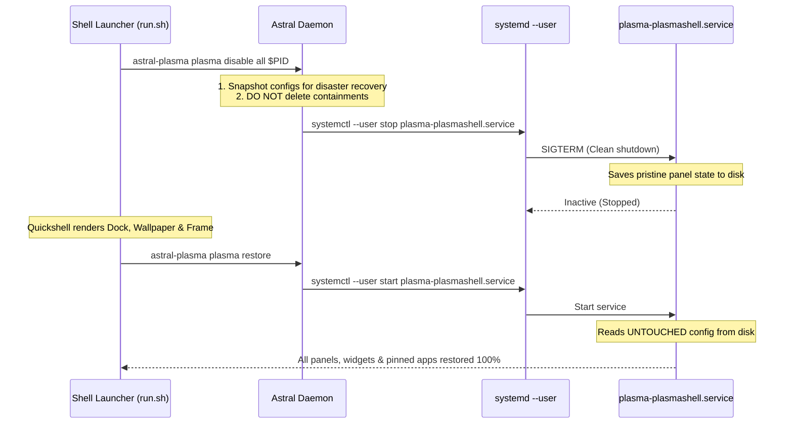

# KDE Plasma & Quickshell Integration Guide

> Authoritative architectural specification and best practices for integrating **Quickshell** with **KDE Plasma 6 & KWin**.

---

## 1. Executive Summary

Desktop shells built with **Quickshell** (such as Astral Plasma) provide custom QML-based bars, docks, app launchers, screen frames, and notifications. When running inside a KDE Plasma 6 Wayland or X11 session, coordinating with KDE's default desktop shell process (`plasmashell`) is essential to prevent visual overlaps, conflicting shortcuts, and duplicate system trays.

Historically, custom shells attempted to hide Plasma panels by **modifying configuration files on disk** or invoking **destructive runtime deletion** (`ps[i].remove()`). This guide documents why that legacy approach is fragile and specifies the **two recommended, production-grade integration architectures**:

1. **Systemd User Unit Lifecycle** *(Recommended for Development & Live Shell Toggles)*
2. **Dedicated Wayland Session Profile** *(Recommended for Production Daily Driving)*

---

## 2. The Legacy Anti-Pattern: Why Runtime Config Tampering Fails

In older iterations, shells attempted to hide Plasma panels by evaluating scripts via D-Bus:

```javascript
// ❌ ANTI-PATTERN: DO NOT USE
var ps = panels();
for (var i = ps.length - 1; i >= 0; --i) {
    ps[i].remove(); // Destructively deletes containments!
}
```

This was coupled with backing up `~/.config/plasma-org.kde.plasma.desktop-appletsrc`, dumping `layout.js` via `dumpCurrentLayoutJS`, and attempting to restore files and replay the layout on shell exit.

### Why This Inevitably Breaks:

1. **Destructive Containment Deletion**: Calling `remove()` deletes applet IDs, widget configurations, and containment metadata from Plasma's runtime model.
2. **In-Memory Cache & Asynchronous Disk Sync**: Plasma 6 periodically syncs its in-memory layout back to disk. If Plasma writes before exit or receives an ungraceful termination signal, the 0-panel state is permanently flushed to `plasma-org.kde.plasma.desktop-appletsrc`.
3. **Lossy Layout Replays**: `dumpCurrentLayoutJS` is designed for initial distro defaults, not lossless state backup. Replaying scripts via `evaluateScript` generates new containment IDs, losing pinned taskbar applications, custom plasmoid settings, and manual sizing adjustments.
4. **Crash Vulnerability**: If the custom shell, compositor, or host PC crashes while the shell is active, the watchdog cannot execute, leaving the user with a broken desktop and **zero panels on subsequent logins**.

---

## 3. Recommended Pattern 1: Systemd User Unit Lifecycle

In **KDE Plasma 6**, the desktop session is partitioned into modular `systemd` user units. The panel, desktop icons, and wallpaper belong exclusively to `plasma-plasmashell.service`. Crucially, **all essential desktop integration services run as independent units**:

| Systemd Unit | Responsibility | Status When Plasmashell Stops |
| :--- | :--- | :--- |
| `plasma-kwin_wayland.service` | Wayland Compositor & Window Manager | **Active** (Window management intact) |
| `plasma-kded6.service` | KDE Background Daemon & StatusNotifierWatcher | **Active** (Tray registrations active) |
| `plasma-powerdevil.service` | Power Management & Battery Policy | **Active** (Brightness & sleep active) |
| `plasma-polkit-agent.service`| PolicyKit Authentication Dialogs | **Active** (Elevation dialogs work) |
| `plasma-kactivitymanagerd.service` | Activities & Virtual Desktops | **Active** (Workspace indexing active) |
| `plasma-plasmashell.service` | Default Panels, Desktop Icons, Wallpaper | **Stopped** (No panel overlap!) |

### The Clean Lifecycle Workflow

Instead of deleting panels, Astral Plasma manages the service lifecycle:



### Why This is 100% Robust:
* **Untouched Configuration**: `plasma-org.kde.plasma.desktop-appletsrc` and `plasmashellrc` are never altered or emptied.
* **Full Crash Resilience**: If Quickshell is killed (`SIGKILL`) or the system reboots, `plasma-plasmashell.service` automatically starts on the next login with all original panels intact.
* **Zero Resource Waste**: `plasmashell` is not running in the background, freeing ~300–500MB RAM and avoiding redundant wallpaper rendering.

---

## 4. Non-Destructive Specific Panel Hiding (`windowscover`)

If a user configures Astral Plasma to only disable a specific panel (e.g. `disablePanels = "top"` or `"bottom"`), `plasmashell` must remain running for the other panels.

In this scenario, Astral Plasma uses **non-destructive visibility masking**:

```javascript
// Non-destructive: sets visibility without deleting containment
var ps = panels();
for (var i = 0; i < ps.length; ++i) {
    if (targets.indexOf(ps[i].location) !== -1) {
        ps[i].hiding = "windowscover"; // Windows & Quickshell overlay the panel
    }
}
```

On exit, Astral Plasma restores visibility:
```javascript
var ps = panels();
for (var i = 0; i < ps.length; ++i) {
    if (ps[i].hiding === "windowscover") {
        ps[i].hiding = "none";
    }
}
```

No containment is deleted, no applets are destroyed, and no configuration files are overwritten.

---

## 5. Recommended Pattern 2: Dedicated Wayland Session

For production daily driving, the cleanest setup is a standalone Wayland session file. This completely eliminates runtime toggling and runs Quickshell as the sole desktop shell.

### 5.1. Session Desktop Entry
Installed in `/usr/share/wayland-sessions/astral-plasma.desktop` (or `~/.local/share/wayland-sessions/`):

```ini
[Desktop Entry]
Name=Astral Plasma (KWin)
Comment=Fluid and expressive desktop shell powered by Quickshell and KWin
Exec=astral-plasma-session
TryExec=quickshell
Type=Application
DesktopNames=KDE:Astral
Keywords=quickshell;kwin;desktop;shell;astral;
```

### 5.2. Session Entrypoint (`astral-plasma-session`)
Located in `~/.local/bin/astral-plasma-session`:

```bash
#!/bin/bash
export XDG_CURRENT_DESKTOP="KDE:Astral"
export XDG_SESSION_TYPE="wayland"
export XDG_SESSION_DESKTOP="KDE"
export QT_QPA_PLATFORM="wayland"

# Boots KWin Wayland with Quickshell as the session master:
exec kwin_wayland --exit-with-session /path/to/astral-plasma/run.sh
```

### Advantages of Dedicated Session:
* **Zero Overhead**: `plasmashell` is never started at all.
* **Isolated State**: The standard KDE Plasma session remains completely untouched for when you want a stock experience.
* **Display Manager Integration**: Appears in SDDM / GDM login screen as a selectable desktop.

---

## 6. Self-Healing & Legacy Migration Safeguards

To protect users whose configurations were corrupted by older scripts prior to this architectural upgrade, Astral Plasma includes **automatic self-healing**:

1. **Intact Config Detection**: On restore, `PlasmaAdapter` inspects `~/.config/plasma-org.kde.plasma.desktop-appletsrc`.
2. **Automatic Backup Restoration**: If the current file has 0 panel containments but the safety backup (`~/.local/share/astral-plasma/plasma-backup/`) contains valid panel entries, Astral Plasma automatically restores the backup before starting `plasmashell`.
3. **Pristine Backup Protection**: Astral Plasma refuses to overwrite a valid backup if the current running session has 0 panels, preventing empty-state propagation.

---

## 7. Developer & Operator CLI Reference

The daemon provides direct commands to inspect and manage the integration state:

```bash
# Check current Plasma panel count and integration status
bin/astral-plasma plasma status

# Disables panels cleanly via systemd
bin/astral-plasma plasma disable all [optional_monitor_pid]

# Restores plasma-plasmashell and verifies DBus liveness
bin/astral-plasma plasma restore
```

To run the shell safely in live development mode:
```bash
./run.sh
```
Pressing `Ctrl+C` triggers the `cleanup()` trap, which restores original shortcuts and restarts `plasma-plasmashell.service`.
