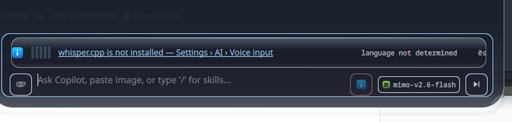
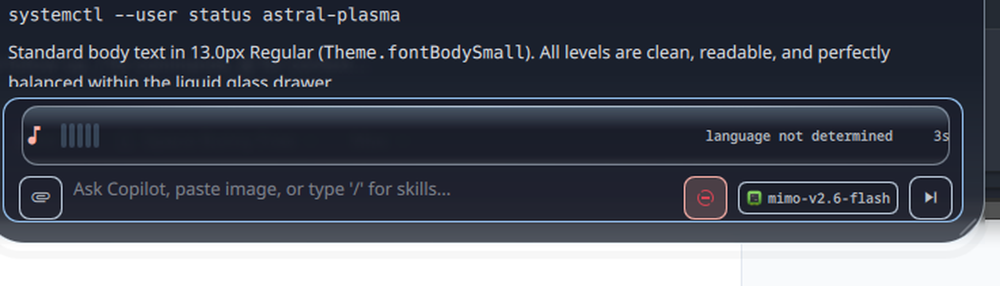
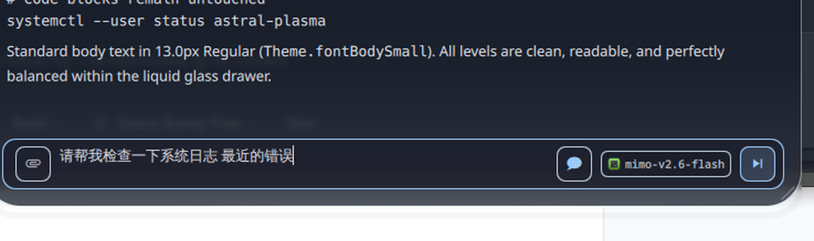

# Voice Input — Implementation Evidence

> Verification record for the voice dictation feature. The authoritative design
> and decision record is [`VOICE-INPUT-SPEC.md`](VOICE-INPUT-SPEC.md).
>
> All captures below were taken from the **running shell** on a live Wayland
> session, driven through Quickshell IPC, per `AGENTS.md` §6.

---

## 1. Test results

```
make test
  Rust : 50 binaries, 545 tests, 0 failures
  QML  : 92 suites,        0 failures
  ALL QML TESTS PASSED! No regressions detected.
```

The mandatory non-regression proof: `daemon/tests/test_audio_visualizer.rs` is
**absent from `git status`** — it was never edited, and it still passes. That is
the evidence that generalising the hardcoded sink capture into a `CaptureTarget`
value object was inert for the audio visualizer.

New coverage added:

| Suite | Tests | What it pins |
|---|---:|---|
| `test_voice_domain.rs` | 43 | Capture argv, WAV framing, silence detection, settings clamping, language normalisation, transcript append |
| `test_whisper_stt_adapter.rs` | 21 | Capability probing, arg construction, transcript extraction (incl. CJK and banner stripping) |
| `test_voice_session_protocol.rs` | 18 | The full `voice session` line protocol end-to-end, hermetic via stub engine and capture |
| `test_doctor_voice.rs` | 5 | Voice is never a required dependency |
| `tst_voice_input.qml` | 42 asserts | Composer geometry, mic-button states, strip honesty, **the no-auto-send safety property** |
| `tst_voice_settings.qml` | 40 asserts | Settings panel readiness derivation, data-driven catalog |

---

## 2. Visual proof

### 2.1 Setup gap — recoverable, actionable



The real state on a host without `whisper.cpp`. The mic button stays **visible
but disabled** — a vanishing mic is undiscoverable. The listening strip appears
with a specific, tappable message naming the missing piece, and the language
field honestly reads **"language not determined"** rather than guessing.

### 2.2 Recording — real microphone, real level



Captured with the microphone genuinely open. The process table at that moment:

```
pw-record --raw --target @DEFAULT_AUDIO_SOURCE@ --latency 32ms \
          --rate 16000 --channels 1 --format s16 -
```

`@DEFAULT_AUDIO_SOURCE@` proves the `CaptureTarget::Source` branch is live, and
`--rate 16000` is whisper's native rate. The level meter is driven by measured
RMS from that PCM — not an animation. The transcript area is empty because
`whisper-cli` streams nothing before the file is done, and the strip does not
fabricate a partial to fill it.

### 2.3 Transcript inserted, not sent



The completed CJK transcript is in the composer, cursor at the end, mic released
(`pw-record` gone, session process exited), button reverted to its idle state.

**The send button is armed but was not pressed.** Nothing was submitted. This is
the D5 safety property: a recognition error must never reach the
`ToolCallProposal` gate unattended, where only a confirmation card stands between
a misheard word and a `sudo` command.

---

## 3. Defects that only visual verification caught

Four real bugs survived a fully green test suite. This is the concrete argument
for `AGENTS.md` §6 — recorded in full in `VOICE-INPUT-SPEC.md` §13.

1. **`stop` did nothing.** The control loop blocked inside the session, so the
   line was written to stdin and never read. Tests passed because every one sent
   `start` and let auto-finalize end the session, never exercising stop
   concurrently. *Found by:* the strip still reading "recording" after `stop`.

2. **The hard cap could be bypassed indefinitely.** It was checked only inside the
   frame loop, which blocks reading the capture pipe — so a stalled stream held
   the microphone open. *Found by:* a session still reporting "recording" after
   **sixteen minutes**.

3. **A detached watchdog could kill an unrelated process.** Dropping the
   `JoinHandle` let it outlive the session and signal a pid the kernel had
   already reassigned. *Found by:* reasoning about reaping order during
   implementation; it reproduced immediately by killing an unrelated shell.

4. **`start` was never sent.** The composer showed "recording" from its own timer
   while the daemon sat blocked on stdin and the microphone was never opened.
   Every layer was individually self-consistent, so no test could catch it.
   *Found by:* `pgrep` showing no `pw-record` while the UI claimed to record.

Two non-defects that shaped the implementation:

- **`mic` and `hourglass_top` glyphs do not exist** in this shell's Nerd Font, and
  the Material Design Icons range maps to unrelated shapes. Adding them anyway
  rendered a *factory silhouette* and *two bars*. Presence in `cmap` is not
  identity — only rendering the component settled it. Voice now uses glyphs proven
  to render, and a test asserts the unverified names are never requested.

- **`services/` and `theme/` ship no `qmldir`**, so `AssistantService`, `Theme` and
  `Colors` resolve as *types* in an offscreen test rather than as singletons.
  Rather than add a `qmldir` — which would change module resolution for the whole
  shell — `ChatInputBar` takes its voice backend as an injectable property, which
  also decouples the component properly.

---

## 4. Design conformance

- **Tier 2 glass.** The strip is a `LiquidGlassCard`, never a bespoke translucent
  `Rectangle`. It inherits the Tier 1 compositor blur and adds no second
  load-bearing glass layer.
- **Notice hierarchy.** The setup notice separates the reason (plain body text)
  from the way out (a monospace path chip, echoing the composer's model chip);
  the error tone is confined to the warning mark, and the strip drops the
  perimeter ring so it reads as a row inside the composer, not a box inside it
  (`docs/LESSONS.md` §9.1).
- **Concentric curvature.** Radius comes from `Theme.radiusGlassItem` with a
  literal fallback, matching every other component in the shell.
- **Motion tokens only.** All transitions use `Theme.animExpressive*` and
  `Theme.curveExpressive*`. No hardcoded durations, no `Easing.Linear` — asserted
  by test.
- **Honest rendering.** Real RMS, real elapsed milliseconds, the engine's reported
  language, `und` shown as "not determined". No placeholder shimmer, no synthetic
  progress.
- **Height discipline.** The strip is counted *inside* the composer's 190px clamp
  rather than added on top, so a listening composer cannot push the fixed
  controls off-screen — the same bounding rule `AGENTS.md` §7.2 applies to the
  dock.

---

## 5. Reproducing

```bash
make test                      # 545 Rust tests + 92 QML suites
sudo pacman -S whisper-cpp     # the engine
astral-plasma voice status     # readiness, including the exact gap
astral-plasma voice install-model ggml-large-v3-turbo
astral-plasma doctor           # voice reported as a non-required check

# In the running shell:
quickshell ipc call assistant open
quickshell ipc call assistant startVoice
quickshell ipc call assistant stopVoice
```

`tools/voice_render_harness.qml` renders all four composer states offscreen over
a real desktop capture for quick regression review. Note that a plain `qml` run
has no `Colors`/`Theme` singletons, so it is for **geometry** review only — colour
truth comes from the live shell.

---

## Notification policy and the error state

Verified in the running shell, not offscreen: colour truth and the absence of the
live readouts are only observable live.

| Screenshot | What it proves |
|---|---|
| `voice-proof/composer-untouched.png` | Opening the assistant with `whisper.cpp` absent raises **nothing**. The mic is present and dimmed; the composer shows no banner. |
| `voice-proof/strip-error-state.png` | After the mic click: a warning mark in the error tone, "whisper.cpp is not installed" in plain body text, the destination as a primary-tinted monospace chip (`Settings › AI › Voice input ›`) that *is* the link into Settings, and a × to dismiss. **No level meter, no `0s` clock, no "language not determined"** — the failure is not dressed as a recording session, and the notice is a row inside the composer rather than a second box inside it. |
| `voice-proof/settings-model-dropdown.png` | The speech-model list expands the panel inline instead of overlaying the sections below it. |

Reproduce:

```bash
./bin/astral-plasma voice status     # gap: engine_missing
quickshell ipc -p "$PWD" call assistant open
quickshell ipc -p "$PWD" call assistant toggleVoice
spectacle -b -n -o /tmp/strip.png
```

`toggleVoice` is the same entry point the mic button uses, which is why it is the
honest thing to drive over IPC.
