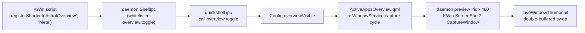

# Active Apps Overview — Walkthrough

Press **Meta** (bare Super) to get a GNOME-style overview of every running
window with live thumbnails; click a card to switch to that window. Esc, the
scrim, or Meta again dismisses it. The surface follows the liquid-glass rules
from `DESIGN.md` / `docs/LESSONS.md`: fullscreen compositor blur, dim scrim,
`LiquidGlassCard` delegates, concentric thumbnail radii (`R_inner = R_outer −
padding`), and the M3 slow-spatial token (650 ms, `curveExpressiveSlowSpatial`)
for the entrance/exit.

## How the Meta key is wired

- `kwin/astral-plasma-shortcuts/contents/code/main.js` registers **AstralOverview**
  on bare `Meta`; `scripts/bind_shortcuts.sh` writes the kglobalaccel entry,
  releases plasmashell's claim on Meta (its launcher keeps `Alt+F1`), and
  registers over D-Bus.
- `daemon/src/application/watch_events.rs` whitelists `overview.toggle` →
  `quickshell ipc call overview toggle`; `shell.qml` exposes the `overview`
  IPC target; `config/Config.qml` owns the transient `overviewVisible` gate
  (opening closes dashboard/popout/launcher — one modal at a time).
- Picking a card runs `WindowService.activateWindow(id)` (KWin script sets
  `workspace.activeWindow` and calls back so the watcher re-arms). Dismissing
  **without** a pick runs `astral-plasma focus restore`, because KWin does not
  hand activation back when the Exclusive focus request is withdrawn.

## Thumbnail pipeline

Reuses the existing `daemon preview <id> <width>` capture (KWin
`org.kde.KWin.ScreenShot2.CaptureWindow`), extended for grids:

- **Aspect fix** (`preview_capture.rs`): captures now *fit inside*
  `target_width × 260` preserving aspect. The old width-locked + height-clamped
  math baked a squashed aspect into portrait/square/strip windows (observed as
  `480×260` for a square source) and fabricated a 40 px minimum height.
- **`components/PreviewCycle.qml`**: one capture at a time across all windows
  through a single `Process` (no racing `CaptureWindow` calls), re-reading the
  window list at every wrap; stopped when the overview closes.
- **`components/LiveWindowThumbnail.qml`**: the drawer's double-buffered
  slot-swap (`preview_<id>_0.png` / `_1.png` round-robin) extracted from
  `FusedBottomPopout` so both surfaces share one flicker-free implementation.
- **`components/OverviewLayout.qml`**: pure grid math — width-driven columns
  gated by `minCellW`, vertical shrink to a `minCellH` floor, grid reports
  overflow so the `GridView` scrolls instead of clipping.

## Latent bug fixed along the way

`ShortcutControlUseCase::snapshot` skipped the adapter whenever a session
backup existed, so newly-managed keys (AstralOverview) never entered the
backup — `shortcuts restore` would have left two owners of Meta. The adapter
now merges missing keys into an active backup without touching recorded
originals (`merge_missing_entries`), and the use-case always reaches it.

## Verification

- **`make test` → EXIT=0**: all Rust suites (~295 tests) + all QML suites,
  0 failures. New coverage: 4 fit-box aspect tests, `tst_preview_cycle`,
  `tst_overview_layout`, `tst_active_apps_overview_wiring` (pins every hop of
  the cross-file Meta chain), 4 snapshot-merge tests, the active-backup gate
  regression test, and the `overview.toggle` whitelist assertion. Every new
  test was observed red before its implementation.
- **Invocation chain**: `invokeShortcut AstralOverview` (kglobalaccel's
  synthetic Meta press) logged `Astral Plasma: Triggering active apps overview`
  in the KWin journal at 22:12:21 / 22:14:38 / 22:18:17 and the daemon hop
  returned `true` after the shell reloaded against the fresh binary.
- **Screenshots** (spectacle, 2560×1600, real windows beneath):

| Proof | File |
| :--- | :--- |
| Overview opened through the Meta-equivalent invoke chain — 7 live cards, titles, icons, scrim + backdrop blur | `/tmp/proof_kbdhop.png` |
| Steady state — all 8 windows live (editors, Lutris, Dolphin, Haruna 16:9 letterboxed correctly, Settings) | `/tmp/overview_fresh.png` |
| Migrated bottom drawer still shows its live Dolphin preview (shared `LiveWindowThumbnail`) | `/tmp/drawer_probe.png` |

## Using it

- **Meta** — toggle overview (bound by `scripts/bind_shortcuts.sh`; re-run it
  after pulling this change).
- `scripts/toggle_overview.sh` or
  `quickshell -p ~/.config/quickshell ipc call overview toggle` — scriptable.
- Esc / scrim click / Meta — close (focus returns to your previous window via
  `focus restore` unless you picked one).
