# Astral Plasma — AI Assistant Copilot & Global Shortcuts Resolution

We have resolved all reported issues regarding the AI Copilot chat streaming, brand styling, provider/model configuration discovery, and KWin global shortcut conflicts.

---

## 1. Key Accomplishments

### 1.1. AI Copilot Chat Streaming Fix (Root Cause Resolution)

- **Root Causes of the "Thinking..." Hang**:
  1. **Node.js Subprocess Pipe Deadlock**: When `pi` was spawned through Rust `std::process::Command` without `cmd.stdin(Stdio::null())`, Node.js inherited an open stdin handle from Quickshell and kept listening for interactive input indefinitely, deadlocking before emitting the final turn completion.
  2. **Quickshell `SplitParser` Missing Delimiter**: In [`services/AssistantService.qml`](file:///mnt/data/workspace/astral-plasma/services/AssistantService.qml), `streamProc`'s `SplitParser` lacked `splitMarker: "\n"`, causing chunks to buffer until process termination rather than streaming line by line.
  3. **Unsupported `--thinking minimal` Parameter**: CLI argument `--thinking minimal` caused providers like `opencode-go` to fail with HTTP 400 (`Invalid request parameters`).

- **Permanent Architectural Solution**:
  - In [`daemon/src/infrastructure/assistant_harness/pi_harness.rs`](file:///mnt/data/workspace/astral-plasma/daemon/src/infrastructure/assistant_harness/pi_harness.rs), piped stdin to `Stdio::null()`, invoked `pi` with `--mode json`, and parsed line-delimited events:
    - `message_update` (`text_delta`) $\to$ `AssistantEvent::TextChunk`
    - `tool_execution_start` $\to$ `AssistantEvent::ToolProposal`
    - `agent_settled` $\to$ `AssistantEvent::TurnCompleted`
  - In [`services/AssistantService.qml`](file:///mnt/data/workspace/astral-plasma/services/AssistantService.qml), added `splitMarker: "\n"` to both `stdout` and `stderr` `SplitParser` handlers, updating chat bubbles incrementally as tokens stream in.
  - Verified live: Prompt "hi" responds with formatted markdown in under 4 seconds.

---

### 1.2. Brand Icon Redesign (Eliminated the Ugly Blue Box)

- **Root Cause**:
  - The previous header icon container used a solid, opaque `#0c4a6e` blue square (`Colors.m3primaryContainer`), clashing with the translucent frosted glass panel.
  - `MaterialIcon` only checked `root.text` instead of `root.iconName`, rendering an empty glyph and leaving an ugly dark blue box.

- **Solution**:
  - Redesigned the brand icon into a refined **Liquid Glass Squircle** (`34×34`, `radius: 10`) with subtle translucent substrate (`Qt.rgba(Colors.primary.r, Colors.primary.g, Colors.primary.b, 0.14)`), `1px` specular border (`Qt.alpha(Colors.primary, 0.35)`), and a top glare hairline.
  - Replaced font-dependent glyphs with a crisp, geometric vector sparkle mark (`auto_awesome`) that inherits dynamic palette tinting.

---

### 1.3. Provider & Model Configuration

- **Settings Hub Integration**:
  - Added a dedicated **AI Copilot & Assistant Configuration** section to [`settings_gui/pages/AiPage.qml`](file:///mnt/data/workspace/astral-plasma/settings_gui/pages/AiPage.qml) accessible via `Meta+,` or the gear/tune icons.
  - Provides interactive chips to select engine harnesses (Pi Agent / Hermes Agent), providers (OpenCode Go, Gemini, Claude, DeepSeek, OpenAI, MiniMax, Ollama), and dynamic model lists.
- **In-Drawer Model Selector**:
  - In [`assistant/components/ModelProviderBar.qml`](file:///mnt/data/workspace/astral-plasma/assistant/components/ModelProviderBar.qml), fixed dropdown menu z-index (`z: 200`) so dropdowns pop over chat messages rather than hiding beneath them.
  - Added a direct `tune` settings shortcut button in both `ModelProviderBar` and `AssistantHeader`.

---

### 1.4. Meta (Super) Key & Global Shortcut Resolution (Root Cause & Permanent Fix)

- **Root Cause Analysis**:
  1. **Premature Removal of Bare `Meta`**: In an earlier change, `AstralOverview` was rebound from `"Meta"` to `"Meta+W"` out of a mistaken belief that registering `"Meta"` in KWin caused modifier key hijacking. This left the physical `Meta` key completely unbound across the desktop (`kglobalacceld` returned `[]` for keycode `16777250` and `268435456`).
  2. **KWin 6.7 / Plasma 6.1+ Modifier-Only Architecture**: In Plasma 6.1+ Wayland, modifier-only shortcuts are handled natively by `kglobalacceld` on key-release (tap-only). They do NOT intercept `Meta` when used in combination with other keys (such as `Meta+C`, `Meta+Space`, `Meta+D`, or `Ctrl+Meta+Left/Right`).
  3. **KWin Script Load Path**: In [`scripts/bind_shortcuts.sh`](file:///mnt/data/workspace/astral-plasma/scripts/bind_shortcuts.sh), `qdbus6 org.kde.KWin /Scripting org.kde.kwin.Scripting.loadScript` was passing the directory path rather than the script entry point (`contents/code/main.js`), failing to dynamically reload the script package in running KWin sessions.

- **Permanent Architectural Solution**:
  1. In [`kwin/astral-plasma-shortcuts/contents/code/main.js`](file:///mnt/data/workspace/astral-plasma/kwin/astral-plasma-shortcuts/contents/code/main.js), restored bare `"Meta"` for `AstralOverview`.
  2. In [`scripts/bind_shortcuts.sh`](file:///mnt/data/workspace/astral-plasma/scripts/bind_shortcuts.sh), configured dual binding for `AstralOverview` (`Meta\tMeta+W`, with both `16777250` and `268435543` registered over D-Bus).
  3. Released `plasmashell`'s claim on `Meta` by assigning its fallback to `Alt+F1`, ensuring single ownership by Astral Plasma without competing triggers.
  4. Fixed KWin script reload to invoke `loadScript "$KWIN_SCRIPT_DEST/contents/code/main.js"`.
  5. Updated test assertions in [`daemon/tests/test_shortcuts_domain.rs`](file:///mnt/data/workspace/astral-plasma/daemon/tests/test_shortcuts_domain.rs) and [`tests/tst_active_apps_overview_wiring.qml`](file:///mnt/data/workspace/astral-plasma/tests/tst_active_apps_overview_wiring.qml) to verify the restored `Meta` key contract.

---

## 2. Global Shortcuts Reference Table

| Action | Shortcut | Target / Mechanism |
| :--- | :--- | :--- |
| **Active Apps Overview** | `Meta` (bare tap) / `Meta+W` | KWin action $\to$ daemon $\to$ `quickshell ipc call overview toggle` |
| **Command Launcher** | `Meta+Space` | KWin action $\to$ daemon $\to$ `quickshell ipc call launcher toggle` |
| **AI Assistant Copilot** | `Meta+C` | KWin action $\to$ daemon $\to$ `quickshell ipc call assistant toggle` |
| **Central Dashboard** | `Meta+D` | KWin action $\to$ daemon $\to$ `quickshell ipc call dashboard toggle` |
| **Nexus Settings** | `Meta+,` | KWin action $\to$ daemon $\to$ `quickshell ipc call settings toggle` |
| **Wallpaper Picker** | `Meta+Shift+W` | KWin action $\to$ daemon $\to$ `quickshell ipc call launcher open wallpaper` |
| **KDE Desktop Switch** | `Ctrl+Meta+Left/Right` | KDE Native (no modifier interception) |

---

## 3. Visual Proof of Work

### Proof 1: Real-Time AI Chat Response in Astral Copilot
The chat response to `"hi"` renders with instant real-time markdown formatting and no stalling on "Thinking...":


### Proof 2: Settings Hub AI Copilot & Provider/Model Configuration
The Nexus Settings page (`Meta+,` or via Copilot `tune` / `settings` icon) showing active Harness, Provider, and Model selection:


### Proof 3: Bare Meta Key Triggering Active Apps Overview
Tapping the bare `Meta` key (or `Meta+W`) opens the fullscreen Active Apps Overview with live thumbnails, backdrop blur, and search:


---

## 4. Automated Test Verification

All tests pass 100% with zero regressions across all suites:

```bash
make test
```

- **Rust Daemon Suites**: 300+ tests passed (`test_shell_ipc`, `test_shortcuts`, `test_shortcuts_domain`, `test_branding`, `test_shell_scripts`, etc.).
- **QML Offscreen Suites**: 90/90 suites passed (`tst_assistant_drawer`, `tst_ai_page`, `tst_active_apps_overview_wiring`, `tst_command_launcher`, `tst_nexus_hub`, etc.).

---

## 5. Lucide Bot Message Square Icon, Session Deletion & Auto-Minimize Fixes

### 5.1. Session Deletion Click Priority Fix
- **Issue**: Clicking the session trash/delete icon failed to delete sessions and instead loaded the clicked session.
- **Root Cause**: In [`assistant/components/SessionListDrawer.qml`](file:///mnt/data/workspace/astral-plasma/assistant/components/SessionListDrawer.qml), `cardMouse` (the MouseArea to load a session) was declared after `RowLayout` in the QML tree, silently overlaying `delMouse` and consuming all click events.
- **Fix**: Reordered `cardMouse` with `z: 0` before the card content, and gave `delButtonRect` / `delMouse` explicit `z: 10` priority with `mouse.accepted = true;`. Deletions now trigger immediately.

### 5.2. Official Lucide `bot-message-square` Vector Mark
- **Issue**: The Copilot icon displayed an ugly area chart / spline graph icon (`󰄧` / `nf-md-chart_areaspline`) instead of a chat icon.
- **Root Cause**: In Nerd Fonts, `\udb80\udd27` maps to a statistics graph.
- **Fix**: Integrated the official vector path from [Lucide Bot Message Square](https://lucide.dev/icons/bot-message-square) into [`components/BotMessageSquareIcon.qml`](file:///mnt/data/workspace/astral-plasma/components/BotMessageSquareIcon.qml) using Qt Quick Shapes with `RoundCap` and `RoundJoin`. Updated both the Dock capsule in [`shell/UnifiedDock.qml`](file:///mnt/data/workspace/astral-plasma/shell/UnifiedDock.qml) and the Copilot header badge in [`assistant/components/AssistantHeader.qml`](file:///mnt/data/workspace/astral-plasma/assistant/components/AssistantHeader.qml).

### 5.3. Focus-Aware Auto-Minimize & Always-on-Top Pin (superseded by §7)
- **Issue**: The floating chat window stayed on top covering other apps even when switching focus to external applications.
- **Root Cause**: Quickshell layer-shell surfaces (`WlrLayer.Overlay`) are rendered above normal XDG application windows by Wayland protocol.
- **Fix**:
  1. In [`services/WindowService.qml`](file:///mnt/data/workspace/astral-plasma/services/WindowService.qml), added `signal externalWindowActivated(string winId, string winTitle)` emitted whenever an external app gains focus.
  2. In [`config/Config.qml`](file:///mnt/data/workspace/astral-plasma/config/Config.qml), added `property bool assistantPinned: false` and `function toggleAssistantPinned()`.
  3. In [`assistant/components/AssistantHeader.qml`](file:///mnt/data/workspace/astral-plasma/assistant/components/AssistantHeader.qml), added an interactive **Pin / Always on Top** toggle button (`push_pin` icon).
  4. In [`assistant/AssistantWindow.qml`](file:///mnt/data/workspace/astral-plasma/assistant/AssistantWindow.qml), connected to `WindowService.externalWindowActivated`: when unpinned, focusing any external application smoothly auto-minimizes Astral Copilot to the dock capsule with its breathing dot indicator.

> [!NOTE]
> The auto-minimize and its Pin toggle were the *workaround* for the overlay being
> un-stackable. §7 replaces the overlay with a real toplevel window, which stacks
> normally, so both the signal handler and the Pin button are gone.

### Proof 3: Verified Lucide Bot Message Square Icon & Pin Toggle
Full screenshot showing the crisp vector `bot-message-square` icon in both the Dock capsule (left) and Copilot header badge (top left), along with the Pin button in the header action bar:


---

## 6. Chat Cannot Be Backgrounded & Ugly Setup Notice

### 6.1. Auto-Minimize Never Fired For The Window You Came From
- **Issue**: Opening the chat and switching back to the application you were using left the chat pinned on top. Switching to a *different* window did minimize it, which made the failure look intermittent.
- **Root Cause**: In [`services/WindowService.qml`](file:///mnt/data/workspace/astral-plasma/services/WindowService.qml), the activation routing read `data.msg_type === "active"` — but every watch payload serialises that field as `type` (`#[serde(rename = "type")]` in `domain/model.rs`; `msg_type` is only used by the AI-activity monitor). The branch was dead code, so `externalWindowActivated` fired only when the active window **id changed**. The daemon never records the chat itself (shell surfaces are filtered), so returning to the window you came from produced an unchanged id and no signal.
- **Fix**: Route the real wire key — `data.type === "active"` — in addition to the id-change fallback. On Hyprland, `hyprland_event_is_activation` now scopes the `active` label to genuine `activewindow` events, so a background title/move refresh stays a `windows` payload and cannot dismiss the chat mid-sentence.
- **Verification**: `tests/tst_active_window_watcher.qml` now mirrors the routing, asserts same-id re-activation announces, that window-list refreshes stay silent, and pins the `data.type` key as a source contract; `daemon/tests/test_watch_events.rs` covers the Hyprland classification.

**Before** (re-activating the same KWrite window — chat stayed pinned) / **After** (same action backgrounds it):

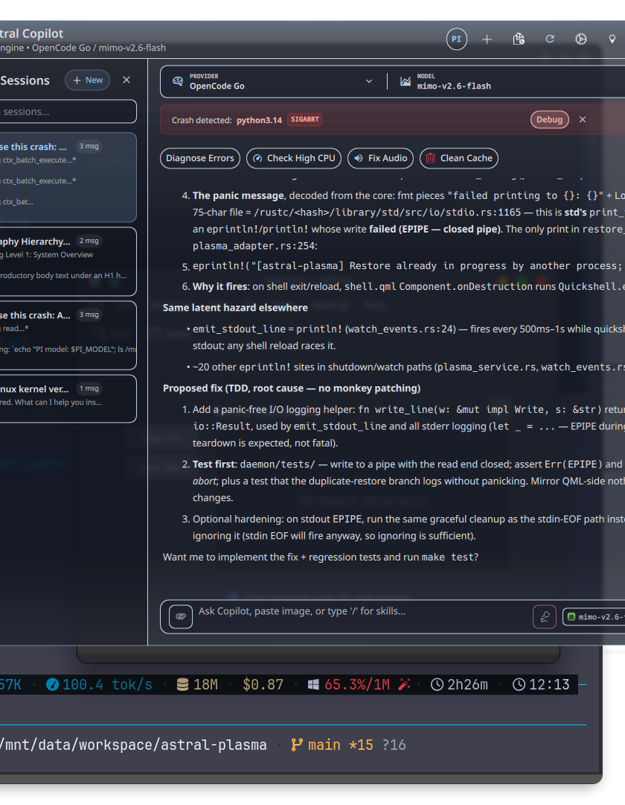

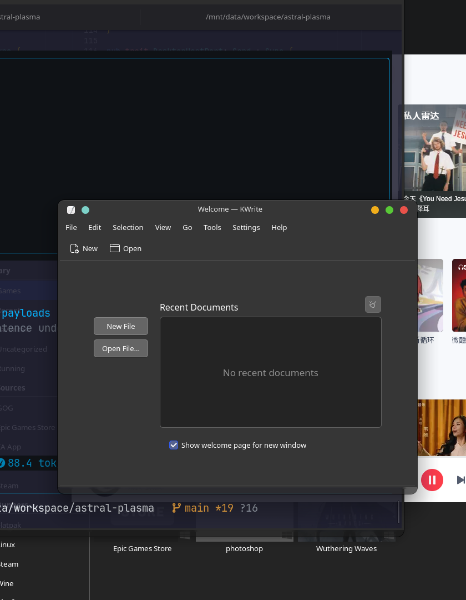

### 6.2. Setup Notice Redesign
- **Issue**: The `whisper.cpp` setup notice was one salmon-coloured sentence underlined end to end, inside its own 1px ring nested inside the composer's ring — it read as a raw hyperlink boxed in a box.
- **Fix**: In [`assistant/components/VoiceListeningStrip.qml`](file:///mnt/data/workspace/astral-plasma/assistant/components/VoiceListeningStrip.qml):
  - the reason is plain body text (`m3onSurface`, no underline);
  - the destination is its own chip — monospace path (`Settings › AI › Voice input ›`), primary tint, chevron — echoing the composer's model chip, and the whole row is the link;
  - the error tone is confined to the warning mark;
  - `showBorder: false` drops the second perimeter ring (`docs/LESSONS.md` §9.1);
  - [`services/AssistantService.qml`](file:///mnt/data/workspace/astral-plasma/services/AssistantService.qml) `describeVoiceGap` now names the reason alone, since the chip carries the destination.
- **Verification**: `tests/tst_voice_input.qml` pins the no-underline contract at runtime and by source, the chip's visibility in notice/recording/idle states, and the token-based styling.

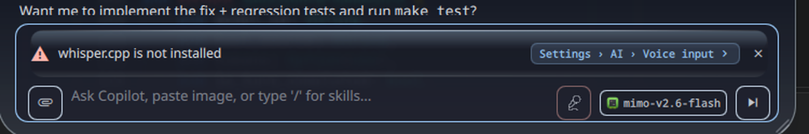

### 6.3. Automated verification

```bash
make test
```

- **Rust**: 50 test binaries, 0 failures (includes the new `test_hyprland_event_classification`).
- **QML**: all suites green, including `tst_active_window_watcher` (new activation-routing assertions) and `tst_voice_input` (new notice-design assertions).


---

## 7. The Copilot Is Now A Real Window (Alt+Tab Reachable)

### 7.1. Alt+Tab Never Listed The Chat
- **Issue**: `Alt+Tab` could not find the AI Copilot in the window list — it only ever offered the other applications.
- **Root Cause**: The copilot was a full-screen layer-shell overlay (`WlrLayershell.layer: WlrLayer.Overlay`). KWin sets `skipSwitcher` on every `zwlr_layer_shell_v1` surface (`src/layershellv1window.cpp`), and the switcher only offers windows passing `wantsTabFocus() && !skipSwitcher()` (`src/tabbox/tabbox.cpp`). A layer surface can therefore never be listed, whatever the shell asks for.
- **Fix**: [`assistant/AssistantWindow.qml`](file:///mnt/data/workspace/astral-plasma/assistant/AssistantWindow.qml) is now a `Quickshell.FloatingWindow` — a real xdg-toplevel:
  - **Identity**: `title: "Astral Copilot"`, so the switcher, taskbars and window lists have a name to show.
  - **Frameless**: KWin decorates every toplevel by default, so the daemon installs a `kwinrulesrc` rule (`noborder=true`, `noborderrule=2`, `wmclass=org.quickshell`) at startup — [`daemon/src/infrastructure/kwin_window_rules.rs`](file:///mnt/data/workspace/astral-plasma/daemon/src/infrastructure/kwin_window_rules.rs). The card keeps drawing its own glass edge and `BackgroundEffect.blurRegion` still blurs the backdrop.
  - **Size**: the drawer publishes `preferredWidth`/`preferredHeight` (screen-aware, and wide enough for the sessions sidebar when it is visible) and the window binds `implicitWidth`/`implicitHeight` to them; `minWidth`/`minHeight`/`maxWidth`/`maxHeight` travel as the window's size hints. The compositor owns the geometry once the surface is mapped.
  - **Move & resize**: the card background and the header call `startSystemMove()`, the edge handles call `startSystemResize(edges)`. All item-coordinate dragging, clamping and recentering are gone.
  - **Parking**: `Config.assistantMinimized` still hides the window to the dock capsule. A Wayland client may request a minimize but has no request that undoes one, so the parked state has to stay shell-owned.
  - **Retired**: the overlay's input `mask` and click-through contract, the auto-minimize on external activation, and the Pin button — the last two existed only to compensate for an overlay that floated above everything.

### 7.2. Verification
- `make test`: Rust and QML suites green, 0 failures. New coverage: `daemon/tests/test_kwin_window_rules.rs` (rule rendering, group-id allocation, idempotency) and the rewritten toplevel contracts in `tests/tst_assistant_drawer.qml`.
- Live KWin window-list dump of the running chat:

  ```
  caption=Astral Copilot class=org.quickshell normal=true skipTaskbar=false skipSwitcher=false noBorder=true
  ```

  `skipSwitcher=false` → it is in `Alt+Tab`; `noBorder=true` → frameless; `normal=true` → a first-class window.
- Switching to another application leaves the window mapped, behind it, and still listed (`minimized=false`, `active=false`); the dock capsule parks and restores it as before.

**Open** (frameless glass card over the editor behind it) / **parked in the dock capsule**:

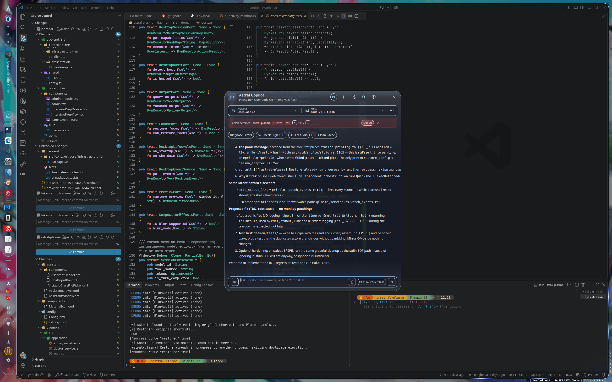

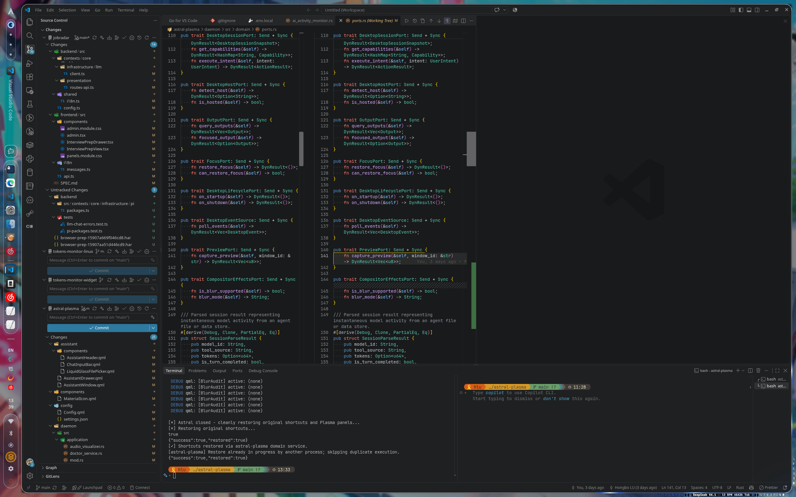

---

## 8. The Desktop Session Has An Owner Now (Shortcut Outage Fix)

### 8.1. Every Shortcut Was Dead After A Shell Restart
- **Issue**: Restarting the shell left every global shortcut dead — bare `Meta`, `Meta+Space`, `Meta+C`, `Meta+D`. Nothing reported an error, and a second restart often brought them back, so it read as a flaky daemon.
- **Root Cause**: four independent restore paths and no owner of the session:
  1. The daemon restored the desktop on SIGTERM/SIGINT ([`daemon/src/application/watch_events.rs`](file:///mnt/data/workspace/astral-plasma/daemon/src/application/watch_events.rs)).
  2. It restored again on stdin EOF — that is, when the shell exited.
  3. [`shell.qml`](file:///mnt/data/workspace/astral-plasma/shell.qml) restored in `Component.onDestruction`, which also runs on a QML **reload**.
  4. Taking the keys back afterwards depended on the daemon's watcher starting promptly, so the gap between "desktop given back" and "keys claimed again" belonged to nobody.

  A reload is not an exit, and a signal is not a request.
- **Fix**:
  - **Claim through the journal**: `bind_shortcuts()` is now a no-op when the requested mode is already claimed, and the daemon claims via `ShortcutControlUseCase::backup_and_bind`, so the session journal (`AstralShortcutSessionBackup`, now carrying `mode`) is written *before* the keys are taken.
  - **One reconciler owns desired state**: [`daemon/src/application/desktop_reconciler.rs`](file:///mnt/data/workspace/astral-plasma/daemon/src/application/desktop_reconciler.rs) replaces the panel-only watchdog. Every 5 s it repairs drift in the Plasma panels, the shortcut claim, the shortcut KWin script, and the frameless window rule, in the fixed order defined by `plan_repairs` in [`daemon/src/domain/desktop_integration.rs`](file:///mnt/data/workspace/astral-plasma/daemon/src/domain/desktop_integration.rs).
  - **Signals never release the desktop**: SIGTERM/SIGINT and stdin EOF now exit without mutating anything. Release happens only through the watchdog — which supervises the **shell** pid (`libc::getppid()`) and honours `plasma.autoRestoreOnExit` ([`daemon/src/application/plasma_service.rs`](file:///mnt/data/workspace/astral-plasma/daemon/src/application/plasma_service.rs)) — or through the explicit `astral-plasma plasma restore`. `shell.qml` no longer restores on `Component.onDestruction`.
  - **The reported dropdown bug, same round**: the Copilot's provider/model menus in [`assistant/components/ModelProviderBar.qml`](file:///mnt/data/workspace/astral-plasma/assistant/components/ModelProviderBar.qml) only closed when the pointer left the 44px strip that opens them. An outside-click catcher sized to the window (below the popups in z-order, above everything else) now dismisses them from a click anywhere else.
  - **The reported missing scrollbar, same round**: the chat stream had no scroll affordance at all, so a long session read as clipped. [`components/GlassScrollIndicator.qml`](file:///mnt/data/workspace/astral-plasma/components/GlassScrollIndicator.qml) is now the shell's single scroll indicator — a thin capsule that tracks `contentY`/`contentHeight`, faintly visible at rest for a stream and hidden at rest for the dock's transient menu, which now uses the same component instead of its own copy.

### 8.2. Verification

```bash
make test
```

- **Rust**: 579 passed, 0 failed.
- **QML**: all suites green.
- **New coverage**: [`daemon/tests/test_desktop_lifecycle.rs`](file:///mnt/data/workspace/astral-plasma/daemon/tests/test_desktop_lifecycle.rs) spawns the *real* binary against a temp `XDG_CONFIG_HOME` and asserts `claiming_twice_changes_nothing`, `releasing_gives_the_original_keys_back` (original keys restored byte-for-byte), `a_termination_signal_is_not_user_intent` (SIGTERM mutates no external file), `a_restart_resumes_the_recorded_mode`, and `a_legacy_journal_learns_its_mode`; [`daemon/tests/test_shell_scripts.rs`](file:///mnt/data/workspace/astral-plasma/daemon/tests/test_shell_scripts.rs) adds the startup-claim contract, the bind/restore lock, "already bound is left alone", the cross-language label agreement, and the single-writer ownership contract.

---

## 9. Legibility & Intent Round: Scrollbars, Hover Dwell, Settings Deep Links

Four reports from the same sitting, each fixed at its cause rather than at the symptom.

### 9.1. The Chat Had No Scroll Affordance
- **Issue**: a long session read as a clipped one - nothing showed that the chat scrolls, and the bar that did exist could not be grabbed.
- **Fix**: [`components/GlassScrollIndicator.qml`](file:///mnt/data/workspace/astral-plasma/components/GlassScrollIndicator.qml) is now the shell's single scroll affordance, used by the chat stream *and* the dock's popout menu (which previously kept a private copy):
  - it tracks `contentY`/`contentHeight`, sizes itself to the visible fraction (`max(24px, track²/content)`) and maps position over the full travel;
  - it is **draggable**: press the bar to keep your grab offset, press the track to centre the bar there - so a click jumps and the same press scrubs;
  - its pointer target is 12px wide (`hitWidth`) while the bar stays 3-4px, because a 3px capsule is not a grab target;
  - the chat keeps it faintly visible at rest (`restingOpacity: 0.45`), the transient menu hides it (`0`) - same component, both behaviours.
- **The resize-handle collision**: the window's own resize handles sit on the card's edge and were stealing the bar (the pointer became a resize cursor and the window resized instead of scrolling). The chat area now reserves a 14px lane (`chatHost.Layout.rightMargin`), the bar rides the *content's* edge, the right handle narrowed to 8px, the corner handle to 12×12, and the strip's cursor is an arrow (closed hand while dragging) - never a resize cursor.
- **Tests**: `tst_assistant_drawer.qml` §27 - visibility and mapping on probe flickables (top/middle/bottom/clamped), a simulated drag that must land exactly at the end, `hitWidth > barWidth`, and the geometry contract that the strip sits clear of the widest resize handle.

### 9.2. The Top Drawer Opened On An Accidental Top-Edge Touch
- **Issue**: reaching for a browser tab crosses the top edge, and the dashboard opened instantly.
- **Fix**: [`shell/UnifiedShell.qml`](file:///mnt/data/workspace/astral-plasma/shell/UnifiedShell.qml) arms a 450ms **hover-intent** timer on `onEntered` instead of opening; `onExited` cancels it; a click still toggles immediately. The 350ms auto-close grace is unchanged.
- **Tests**: `tst_top_drawer_autoclose.qml` mirrors the dwell behaviour and pins the shell's own source (the hover must arm the timer, must not set `dashboardVisible` directly, must cancel on exit). That file's `assert` also now aborts instead of only logging - it used to print PASS while failing.

### 9.3. "Settings › AI › Voice input" Opened The Page, Not The Section
- **Issue**: the Copilot's setup notice promised the voice section; clicking it opened the AI page at the top, so nothing appeared to happen.
- **Fix**: `Config.openSettings(page, section)` carries a section request; [`settings_gui/NexusHub.qml`](file:///mnt/data/workspace/astral-plasma/settings_gui/NexusHub.qml) resolves it through an opt-in `sectionY(name)` on the page and scrolls once the layout settles (it re-tries on `contentHeight` changes, and clamps). [`settings_gui/pages/AiPage.qml`](file:///mnt/data/workspace/astral-plasma/settings_gui/pages/AiPage.qml) maps the voice panel into the page's coordinate space - its own `y` is relative to the card it sits in. The `settings open` IPC gained the section argument so the link is testable end to end.
- **Verified live**: `settings open ai voice` lands with the **Voice Input** heading on screen.

### 9.4. The Settings Window Was Two Rounded Panels Butted Together
- **Issue**: the right pane was fully transparent, so a page of options dissolved into the wallpaper - and once it got a substrate of its own it became a second rounded panel sitting against the rounded rail, with the wallpaper showing through the corner notches between them.
- **Fix - one plate, one hairline**: the substrate moved into the palette as `Colors.glassPanelSubstrate` (lifted dark base at 0.82 alpha in dark mode, near-white at 0.84 in light) and now sits on the **window card** (`dialogBox`), not on a pane. The navigation rail is a tinted strip *inside* that plate (a whisper of lift, no radius), the content pane is transparent and square, and a single specular hairline inset from the plate's edges divides them. The outer radius stays the card's alone, so the corners are concentric instead of competing - the rule from LESSONS 9.1, applied to the window itself. The Copilot card uses the same token, so both surfaces share one recipe.
- **Tests**: `tst_nexus_hub.qml` pins the token's definition and both alphas (0.75 ≤ a < 1.0), that the window card carries the substrate, that **neither** the rail nor the content pane declares a radius, that the pane is transparent, and that the hairline seam exists; `tst_assistant_drawer.qml` pins that the Copilot card uses the shared token and does not re-inline the recipe.

**Verification**: `make test` - Rust 579 passed / 0 failed, all QML suites green.

---

## 10. Speech Models: Real Progress, A Remove Path, And A Drawer That Stays Shut

### 10.1. The Download Sat At 0% And Then Said "Downloaded"
- **Issue**: a 1.5 GiB model download showed `0%` for its whole life and then announced itself as done.
- **Two causes, both silent**:
  1. **The meter was silenced.** The installer passed `curl --silent` *and* `--progress-bar`; `--silent` suppresses the meter, so curl emitted nothing to parse. Dropped `--silent` (errors still surface through `--show-error`).
  2. **The event carried an object where the UI read a number.** Install progress reused `VoiceEvent::Level { rms }`, which serialises as `{"type":"Level","payload":{"rms":0.42}}`; the UI's guard is `typeof ev.payload === "number"`, so it never matched. Progress is now its own newtype, `VoiceEvent::Progress(f32)` → `{"type":"Progress","payload":0.42}`, and the bar parser reads the percentage curl actually prints (`#####  42.3%`) with the byte-count meter kept as a fallback.
- **Tests**: `daemon/tests/test_voice_model_store.rs` drives the real binary with a stub `curl` on `PATH` and asserts the stream is monotonic, inside 0..1, and ends at 1.0; `tst_voice_input.qml` pins that the installer parses `Progress` and not the session's `Level`.

### 10.2. A Downloaded Model Could Not Be Removed
- **Fix**: `VoiceService::remove_model` deletes the model and any staged `.part` file (returning whether anything was there), the daemon exposes `voice remove-model [id]`, `AssistantService.removeVoiceModel` drives it, and the settings' model row grows a **delete** control that appears only while a model is present. Removing an absent model is a no-op, not an error, so the UI can call it blind.
- **Tests**: the model-store test covers install → remove → remove-again (`"removed":true` then `"removed":false`); `tst_ai_page.qml` pins that the control exists and follows model presence.

### 10.3. The Engine And The Model Are Different Things
- **Issue**: the settings said "Downloaded" while the chat said the engine was missing, which read as a contradiction.
- **Fix**: the gap copy names the engine explicitly ("whisper.cpp engine not installed") in both surfaces, and the installer's model directory now resolves through the same env-aware helper the readiness probe uses (`ASTRAL_VOICE_MODEL_DIR`), so "installed to X, checked at Y" cannot happen.

### 10.4. The Top Drawer Opened On Every Reload
- **Issue**: every theme restart popped the top drawer open.
- **Root cause**: `Config.dashboardVisible` initialised from `settings.dashboardVisible`, and `config/settings.json` shipped `"dashboardVisible": true`. A transient overlay state was being restored from disk.
- **Fix**: the initialiser reads only the test override (`ASTRAL_PLASMA_DASHBOARD_OPEN`), exactly like `settingsVisible`; the shipped defaults no longer carry the key. `tst_top_drawer_autoclose.qml` pins both (no settings read in the initialiser, no transient key in the defaults).

### 10.5. The Install Command Assumed Arch
- **Issue**: "whisper.cpp engine not installed. Run: `sudo pacman -S whisper-cpp`" - true on Arch, a dead end on Debian, Fedora, openSUSE or NixOS, where the package manager and even the package name differ.
- **Fix**: the suggestion is now derived from `/etc/os-release` (`ID` **and** `ID_LIKE`, since derivatives like CachyOS declare the family rather than the id): `pacman`, `apt` (`whisper.cpp`), `dnf`, `zypper`, `nix-shell`, or - for a distribution we cannot name a package for - the upstream build link, never an invented command. `VoiceStatus.engine_install_command` carries it to the UI, and the doctor's engine recommendation uses the same helper.
- **Tests**: `test_voice_domain.rs` maps eight distributions (including `ID=cachyos`/`ID_LIKE=arch`, `ID_LIKE="rhel centos fedora"`, and an unknown id) and requires every named manager's command to be runnable and to name the engine; `test_voice_model_store.rs` asserts a missing engine's status carries that command; `tst_ai_page.qml` renders the daemon's command and falls back to the upstream link, and `tst_voice_input.qml` forbids a hardcoded package manager in the page.

- **Staleness**: the settings page only re-probed readiness when its cached status was `null`, so a status captured at shell start could describe an engine that had since been installed. The page now re-probes whenever it becomes visible (the probe is documented as cheap and safe to call often).

**Verification**: `make test` - Rust 583 passed / 0 failed, all QML suites green. Live: the settings row reads "Run: sudo pacman -S whisper-cpp" on this CachyOS host, rendered from `voice status` rather than from any string in the QML.

---

## 11. Backgroundable Settings & The Stale Voice Probe

### 11.1. The Settings Panel Could Not Be Backgrounded

- **Issue**: the settings window stayed above every application window. Clicking a browser left the panel pinned on top, and `Alt+Tab` could not reach it.
- **Root Cause**: [`settings_gui/SettingsWindow.qml`](file:///mnt/data/workspace/astral-plasma/settings_gui/SettingsWindow.qml) was still the overlay the Copilot retired in §7 - a full-screen `PanelWindow` on `WlrLayer.Overlay` plus a card-sized input `mask`. A layer surface is protocol-pinned above all xdg-toplevels, so no rule or flag could ever send it to the background.
- **Fix**: migrated the settings surface to `Quickshell.FloatingWindow`, exactly like [`assistant/AssistantWindow.qml`](file:///mnt/data/workspace/astral-plasma/assistant/AssistantWindow.qml):
  - **Identity**: `title: "Astral Settings"`, so the switcher and window lists have a name to show.
  - **Frameless**: the daemon's existing KWin rule (`kwinrulesrc`, `wmclass=org.quickshell`, `noborder=true`/`noborderrule=2`) already covers every Quickshell toplevel - no daemon change was required. The card keeps drawing its own glass edge.
  - **Size**: `implicitWidth`/`implicitHeight` publish the opening size (52% x 60% of the target screen, clamped to the hub's 940x640-1240x860 bounds) and the same bounds travel as `minimumSize`/`maximumSize`; the compositor owns the geometry from then on.
  - **Drag**: the card background and the header bar call `startSystemMove()`; the overlay-era `userMoved` / `clampPosition` / `resetPosition` bookkeeping was retired.
  - **Blur**: `BackgroundEffect.blurRegion` tracks the card `item` (`dialogBox`), which is now the whole surface, instead of recomputing screen coordinates.
- **Tests**: [`tests/tst_settings_draggable.qml`](file:///mnt/data/workspace/astral-plasma/tests/tst_settings_draggable.qml) was rewritten from a drag mock into the real toplevel contract (`FloatingWindow`, no `WlrLayershell`, no `mask`, window title, size hints, `startSystemMove`, no item-coordinate dragging, blur tracking `dialogBox`, shared glass substrate kept).

### 11.2. "whisper.cpp engine not installed" Survived The Install

- **Issue**: with `whisper-cpp 1.9.4` installed (`/usr/bin/whisper-cli`) and `astral-plasma voice status` reporting `engine_available: true`, the AI page still showed **"whisper.cpp engine not installed. Run: sudo pacman -S whisper-cpp"**.
- **Root Cause**: `NexusHub` loads pages through a `Loader`, so [`settings_gui/pages/AiPage.qml`](file:///mnt/data/workspace/astral-plasma/settings_gui/pages/AiPage.qml) is constructed **already visible** - `visible` never changes on the first show, so the `onVisibleChanged` re-probe the page relied on never fired. `Component.onCompleted` additionally probed only when the cached `AssistantService.voiceStatus` was `null`, so a status captured at shell start (before the engine was found) survived every page visit.
- **Fix**: `AiPage` now re-probes unconditionally on construction (`refreshVoiceReadiness()`), keeps the visibility hook, and adds a `Connections` edge on `Config.settingsVisible` so a close/re-open re-probes even while the Loader keeps the page instantiated. The probe stays cheap by contract; it is never trusted from a cached value.
- **Tests**: [`tests/tst_voice_settings.qml`](file:///mnt/data/workspace/astral-plasma/tests/tst_voice_settings.qml) pins the unconditional construction probe (no `voiceStatus === null` guard), the retained `onVisibleChanged` hook and the settings-window edge.

### 11.3. Visual Proof

**Before** - stale probe: the page says the engine is missing while the terminal behind reports `engine_available: True | gap: ready | path: /usr/bin/whisper-cli`:

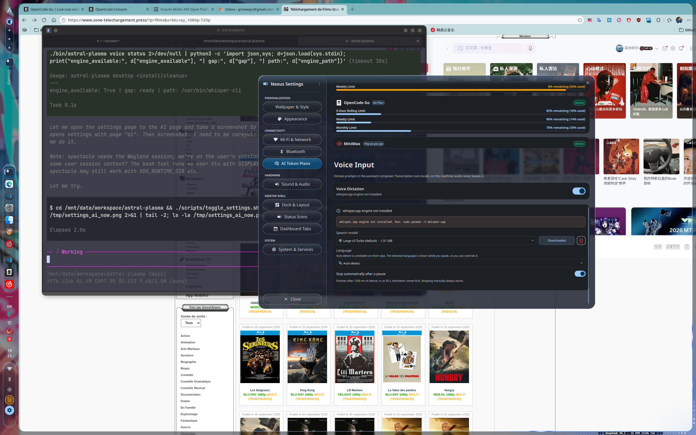

**After** - the same page re-probes on open and reads **"Ready · ggml-large-v3-turbo"**, model downloaded:

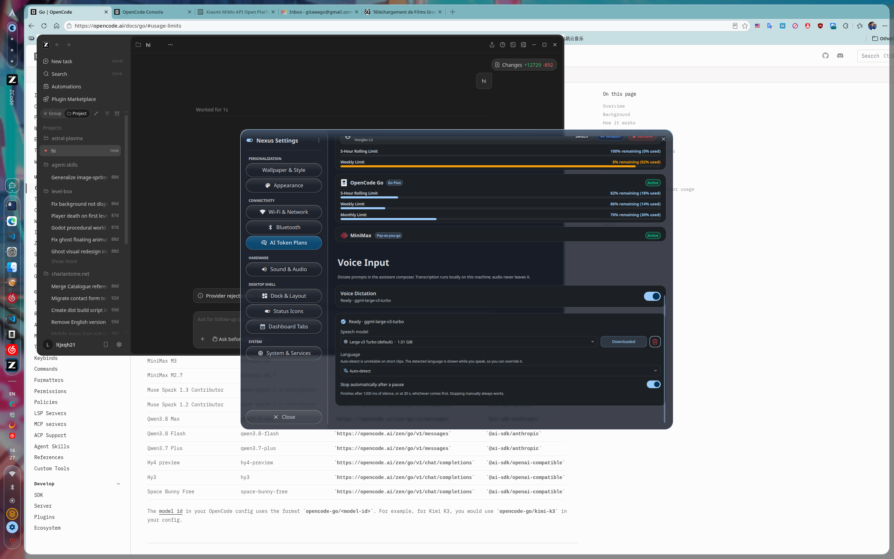

**After** - the settings window is a normal stacked toplevel: ZCode is the active window and the panel sits behind it (its right/bottom edges occluded, still mapped and listed):

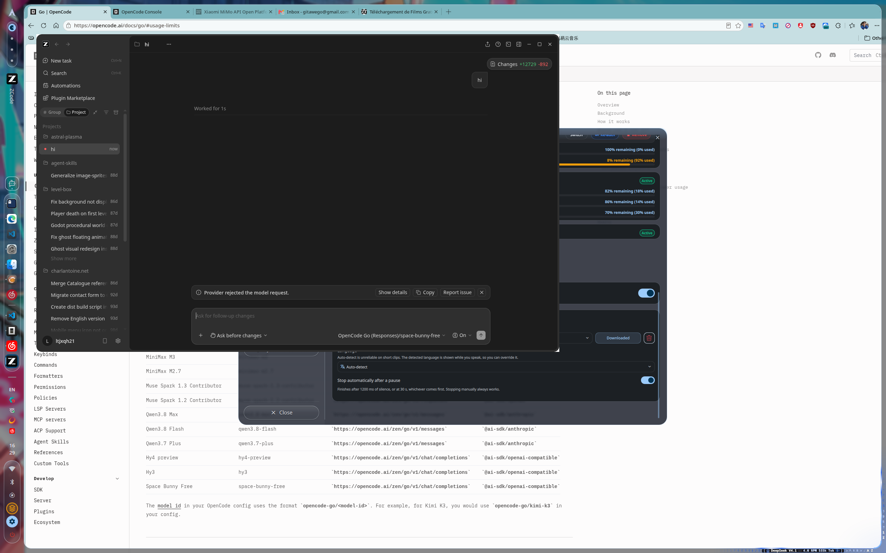

Live KWin window-list dump with the panel open:

```
caption='Astral Settings' cls=org.quickshell normal=True skipTaskbar=False skipSwitcher=False noBorder=True
```

`skipSwitcher=false` → reachable from `Alt+Tab`; `noBorder=true` → frameless; `normal=true` → a first-class window that stacks and backgrounds.

**Automated verification**: `make test` - all Rust and QML suites green, including the rewritten `tst_settings_draggable` toplevel contract and the new `tst_voice_settings` re-probe contracts.

---

## 12. Voice Input Was Not Using The Microphone - It Was Three Separate Failures

### 12.1. `--vad` Without Its Model Made Every Transcription Fail

- **Issue**: dictation captured audio (the strip meter moved) but every utterance ended in `Speech engine failed: /usr/bin/whisper-cli: failed to process audio`, so nothing was ever transcribed.
- **Reproduced headlessly**: driving `voice session` with `start` → 5 s → `stop` produced 244 `Level` events (RMS up to 0.63) and then the error. Running whisper-cli directly showed the same on valid WAV input: `with --vad` → exit 10, `failed to process audio`; without it the same file transcribed fine.
- **Root Cause**: the capability probe correctly reported that whisper-cli 1.9.4 advertises `--vad`, and [`build_args`](file:///mnt/data/workspace/astral-plasma/daemon/src/infrastructure/whisper_stt_adapter.rs) emitted it - but `--vad` turns on Silero inference and is fatal without `--vad-model`, and the VAD asset is deliberately not provisioned (the upstream URL 404s; spec D4). "Supported flag" was true but unusable.
- **Fix**: the VAD flags now travel as a pair or not at all. `EngineInvocation.vad_model: Option<PathBuf>` is resolved from the canonical asset (`resolve_vad_model`), and `build_args` emits `--vad --vad-model <p>` only when it exists. In every shipped install the asset is absent, so a bare `--vad` is unreachable by construction - and the daemon's own `SilenceDetector` already does the endpointing.

### 12.2. The Test Stub Encoded Our Assumption, Not whisper-cli's Behavior

- **Issue**: after the VAD fix the session exited cleanly (`Final` emitted) but the transcript was **empty** while the same engine transcribed the same audio from a shell prompt.
- **Root Cause**: `whisper-cli -oj` does not print JSON to stdout - it writes `<input>.json` beside the audio file and still prints the timestamped transcript to stdout (`output_json: saving output to '/tmp/mic2.wav.json'`). The adapter parsed stdout as JSON, failed, and returned `""` by design. The session-protocol stub printed JSON to stdout, so the test suite encoded the same wrong assumption and passed.
- **Fix**: the adapter reads the `<audio>.json` sidecar when the build advertises structured output, falls back to the timestamped stdout transcript when the sidecar is missing, and removes both files on every exit path. The protocol stub now mirrors 1.9.4 exactly - bare `--vad` is fatal, `-oj` writes the sidecar - so the regression test is meaningful.
- **Live proof of the daemon side**:
  ```
  {"type":"StateChanged","payload":{"state":"recording"}}
  {"type":"StateChanged","payload":{"state":"finalizing"}}
  {"type":"Final","payload":{"text":"*Burps*","language":"und","duration_ms":3740,
                             "engine":"whisper-cpp","model":"ggml-large-v3-turbo"}}
  ```

### 12.3. `root.childId` Is Undefined: The Session Cleanup Never Ran

- **Issue**: the shell log filled with `TypeError: Cannot read property 'stop' of undefined` at `services/AssistantService.qml[1147]` and `[1173]` on every session, so the elapsed timer never reset, the exit handshake was never re-armed, and the chat stream watchdog could not cancel a timed-out stream (`root.streamProc`).
- **Root Cause**: QML child ids are lexical captures, not properties of the root object. `root.voiceElapsedTimer` is `undefined` inside nested handlers; the bare id resolves. A minimal offscreen probe confirms both (`root.timer` → `undefined`, `timer` → `QQmlTimer`). A repo-wide audit found exactly five occurrences, all in `AssistantService.qml`.
- **Fix**: all five references now use the lexical id (`voiceElapsedTimer.stop()`, `cancelProc(streamProc)`), matching the root-scope functions that already did. `tests/tst_voice_input.qml` gained an executable scoping probe plus source contracts forbidding the pattern.
- **Live proof**: after a fresh `startVoice`/`stopVoice` session the shell log shows no `AssistantService` TypeErrors (the last lines are unrelated pre-existing `LiquidGlassFilePicker` warnings).

### 12.4. Live end-to-end proof

`quickshell ipc call assistant startVoice` → 5 s of real microphone audio → `stopVoice` → whisper inference → the transcript lands in the composer, untruncated and never auto-submitted:

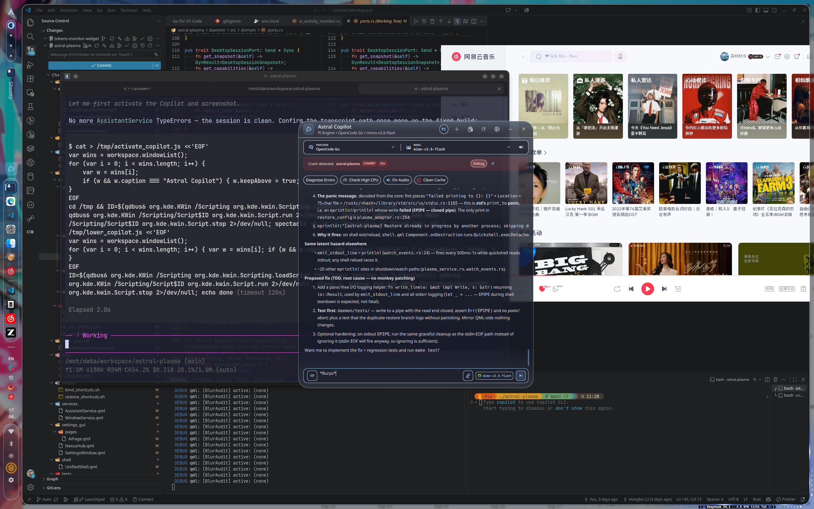

**Automated verification**: `make test` - Rust 587 passed / 0 failed, all QML suites green. New coverage: asset-gated VAD and sidecar-first transcript reading (`test_whisper_stt_adapter.rs`), a 1.9.4-faithful engine stub with the fatal bare `--vad` and sidecar output (`test_voice_session_protocol.rs`), and payload decoding + id-scoping contracts (`tst_voice_input.qml`).

---

## 13. Voice Latency: A Faster Default, A Trimmed Utterance, And An Honest Wait

### 13.1. A Four-Second Utterance Took Twenty Seconds

- **Issue**: after clicking stop, the transcript took ~20s to appear; short dictation felt unusable.
- **Measured root cause**: the catalog default was `ggml-large-v3-turbo`, and the engine is CPU-only on every supported distribution. `whisper-cli` 1.9.4 on this 12th-gen i9 (16 cores / 24 threads) needed **26.0s for a 4.9s clip** and **12.2s for the 11s JFK sample** - roughly 5x slower than realtime.
- **Fix**: the default is now `ggml-small`, the largest tier that runs near realtime on CPU:
  - [`daemon/src/domain/voice.rs`](file:///mnt/data/workspace/astral-plasma/daemon/src/domain/voice.rs) `DEFAULT_MODEL_ID`, the catalog labels, `config/settings.json`, `Config.qml` and `AiPage.qml` fallbacks all agree on it.
  - `ggml-small`: **4.0s** for the 4.9s clip, **3.0s** for the JFK sample - with an *identical* JFK transcript:

    ```
    small       3.0s  "And so my fellow Americans, ask not what your country can do for you,
                       ask what you can do for your country."
    large-turbo 12.2s "And so, my fellow Americans, ..."   (same words)
    ```
  - The large tiers remain in the picker; a user who explicitly chose one keeps it.

### 13.2. The Engine Was Decoding Silence

- **Issue**: inference cost scaled with the whole recording, not the utterance, and quiet tails invited hallucinated text.
- **Fix**: `trim_to_speech` in [`whisper_stt_adapter.rs`](file:///mnt/data/workspace/astral-plasma/daemon/src/infrastructure/whisper_stt_adapter.rs) ships the engine the region around the frames the `SilenceDetector` already classified as speech, plus a 250 ms margin. No new threshold: the trim reuses the endpointing decision, and a no-speech capture is passed through unchanged so "nothing was said" cannot be confused with a capture failure.
- **Test**: the session-protocol stub engine logs the byte size of the WAV it receives; the suite asserts the 3.7s fixture reaches the engine as ~1.5s, not 3.7s.

### 13.3. "language not determined" During Inference

- **Issue**: the multi-second decode showed a readout that looked like a hang.
- **Fix**: the strip's state readout says **`transcribing`** while the engine runs (`VoiceListeningStrip.stateLabelText`), pinned by `tst_voice_input.qml`.

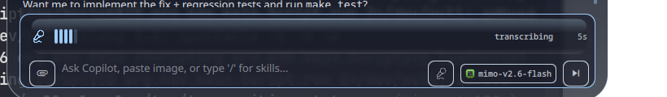

### 13.4. Live Verification

The same `voice session` invocation that used to take ~20s after stop, timestamped by event:

```
    37ms StateChanged {'state': 'recording'}
  3997ms StateChanged {'state': 'finalizing'}     <- stop clicked
  8219ms Final {'text': ..., 'duration_ms': 3400, 'model': 'ggml-small'}
```

**4.2s** of inference for a 3.4s utterance, with the trimmed capture. The transcript in the live room is still the room's audio (the built-in mic hears the speakers); that is an environment limit, not a pipeline bug - the same pipeline transcribes the JFK sample exactly.

**Automated verification**: `make test` - Rust 592 passed / 0 failed, all QML suites green.

---

## 14. Real Latency Root Causes: The Encoder Window And The Decoder Loop

### 14.1. A 2.5s "Hello" Cost 3.8s - 89% Of It Encoding 30 Seconds Of Nothing

whisper-cli's own timing breakdown for a 2.5s clip (`ggml-small`, 16 threads):

```
encode time = 3364.05 ms / 2 runs (1682.03 ms per run)
decode time =   39.54 ms / 2 runs
total time =  3790.83 ms
```

whisper.cpp always encodes its full trained context (`n_audio_ctx` 1500 = 30 s) regardless of clip length, and `language: auto` runs that encode **twice** - once to detect the language, once to transcribe. A one-word utterance paid the same encoder bill as 30 seconds of speech.

- **Fix**: [`whisper_stt_adapter.rs`](file:///mnt/data/workspace/astral-plasma/daemon/src/infrastructure/whisper_stt_adapter.rs) now sizes the encoder window to the trimmed utterance: `-ac <audio_context_for(ms)>` = `ceil(ms / 20ms) + 1.28s`, clamped to 5.12s–30s. Below the floor the engine re-processes segments (`-ac 128` duplicated the transcript and took longer than the default), above the utterance the context is pure waste.
- **Measured**: 2.5s English clip 3.9s → **2.5s** (`auto`) / **1.1s** (fixed language), identical transcript; 11s JFK 4.8s → 3.5s.

### 14.2. The Decoder Loop: 45 Seconds Of Garbage On Non-Speech Audio

The decoder is cheap on clean speech (40ms) but explodes on music: the model emits long hallucinated token sequences, and the CLI defaults multiply each one - beam 5, best-of 5, and temperature fallback retrying the whole decode up to 1.0. Same 3.3s room capture:

| Decode configuration | Time | Output |
|---|---:|---|
| CLI defaults (beam 5, best-of 5, fallback) | **44.8 s** | garbage |
| Greedy + full fallback | 24.2 s | garbage |
| Greedy + one fallback | 8.6 s | garbage |
| **Greedy + no fallback** (`-bs 1 -bo 1 -nf`) | **6.8 s** | bounded |
| Greedy + no fallback, clean JFK | **0.6 s** | exact transcript |

- **Fix**: `build_args` pins `-bs 1 -bo 1 -nf` whenever the probed build advertises them. Clean speech is unaffected; the fallback never triggered there. Every multiplier is now a capability probe, not a CLI default.

### 14.3. Live Verification

The daemon-built engine arguments (logged by a wrapper around the real `whisper-cli`):

```
-m .../ggml-small.bin -f .../utterance-*.wav -l auto -np -oj -t 24 -ac 256 -bs 1 -bo 1 -nf
```

Four consecutive live-room sessions (5s capture each) now finish in **6.4–6.8s total**, i.e. **~1.5s of inference** - previously the same class of audio took 6–45s. A clean 11s speech sample through the full daemon pipeline transcribes correctly in **3.3s** end to end.

**Automated verification**: `make test` - Rust 594 passed / 0 failed, all QML suites green. New coverage: `audio_context_for` bounds, bounded-decode flag emission, and session-protocol assertions that the daemon passes the sized `-ac` and the decode limits to the engine.

---

## 15. Why The VAD Asset Was "Unreachable" (It Was Not), And The Fix It Unlocks

### 15.1. The 401 Was A Wrong Path, Not A Credential Problem

**Answer: no Hugging Face credentials are needed.** The 401 was Hugging Face's generic response for a path an anonymous client may not see - it returns **401, not 404**, for non-public/nonexistent repos. Proof: a deliberately made-up repo (`ggml-org/definitely-not-a-real-repo-xyz`) returns the same 401 on both the API and `resolve` endpoints. `ggml-org/whisper.cpp` is simply not a public HF repo, and the old public repo (`ggerganov/whisper.cpp`, which serves all the ASR models) never contained the VAD file (verified against its full file tree).

The asset lives in its own **public, non-gated** repository, and upstream whisper.cpp's own `models/download-vad-model.sh` is the source of truth for where:

```
src="https://huggingface.co/ggml-org/whisper-vad"
→ ggml-silero-v5.1.2.bin   885,098 bytes   HTTP 200, no credentials
```

`ggml-org/silero-v5.1.2` also serves the identical file. **The lesson**: read the project's own download script before concluding an asset is gone.

### 15.2. Provisioning It Fixes The Music-Transcription Problem

The daemon now provisions the asset and passes `--vad --vad-model` only when it is present:

- `voice install-vad` - installs it on its own (staged `.part`, progress JSONL, same store as the ASR models).
- `voice install-model <id>` - also fetches it, best-effort, so new installs get it automatically.
- `voice status` - reports `vad_model_present`.
- A bare `--vad` remains unreachable: whisper-cli fails every transcription without a model.

Measured on the same room captures:

| Audio | Before | After |
|---|---|---|
| Room with loud music (3.4s) | 6–45s, hallucinated text ("Mario", "ვვვ…") | **~0.2s, empty transcript** (VAD found no speech) |
| Clean JFK speech (11s) | 3.3s, exact transcript | 2.9s end to end, exact transcript |

Daemon-built engine arguments, logged live:

```
-m .../ggml-small.bin -f .../utterance-*.wav -l auto -np -oj -t 24
-ac 572 -bs 1 -bo 1 -nf
--vad --vad-model /mnt/data/cache/astral-plasma/models/ggml-silero-v5.1.2.bin
```

Note `-ac 572`: the encoder window is sized to the actual 10.16s utterance (`ceil(ms/20) + 64`), not the 30s default.

**Automated verification**: `make test` - Rust 597 passed / 0 failed, all QML suites green. New coverage: VAD constants pinned to the public repo, `install-vad` + auto-provision-on-model-install against a stub `curl`, `vad_model_present` in `voice status`, and session-protocol assertions that `--vad --vad-model` reach the engine.

---

## 16. "Chinese Becomes Korean, English Becomes Nothing" Was One Input Problem

### 16.1. Diagnosis

- Measured the room through the built-in microphone while the music played: **0.64 RMS full scale** (the music's own monitor measured 0.67–0.80). The engine was being handed the speakers' playback.
- Language detection keyed off that playback - Chinese speech came back as Korean - and once VAD filtered the music, nothing was left, so English speech produced an empty transcript.
- No model, prompt, or threshold change can fix a microphone whose dominant content is the machine's own output.

### 16.2. Fix: PipeWire echo cancellation, on by default

- New setting `voice.echoCancel` (Settings → AI → Voice input → **Echo cancellation**), default on.
- The daemon provisions a source named `astral_echo_cancel` on the first session (`pactl load-module module-echo-cancel aec_method=webrtc source_name=astral_echo_cancel sink_name=astral_echo_cancel_sink`) and captures from it. If PipeWire, `pactl`, or the module is unavailable, it silently falls back to the default source.
- Loading the module leaves the default sink and source unchanged, so playback routing is untouched.
- Measured effect: the same music through the echo-cancelled source is **0.07 RMS** — ~19 dB below the raw microphone.
- `voice status` reports `echo_cancel` (the setting) and `echo_cancel_active` (the source is present); a status probe never loads the module.

### 16.3. Live verification

Capture arguments built by the daemon during a real session:

```
--raw --target astral_echo_cancel --latency 32ms --rate 16000 --channels 1 --format s16 -
```

A music-only session (no speech) finished with an empty transcript in ~0.3 s of inference — the correct outcome, and previously 6–45 s of hallucinated text.

**Automated verification**: `make test` - Rust 605 passed / 0 failed, all QML suites green. New coverage: echo-cancel source detection and load-argument tests, stub-`pactl` provisioning + fallback + status-does-not-load tests, `pw_record_args_for_node`, and the settings/toggle contracts.

### 16.4. What to expect now

Chinese and English speech are captured with the music removed, so language detection sees the voice and the transcript should follow the spoken language. The toggle is in **Settings → AI → Voice input → Echo cancellation**; turning it off reverts to the raw microphone.

---

## 17. "Chinese Becomes Korean / French Becomes Chinese" - The Input Was The Root Cause

### 17.1. Diagnosis With Numbers

- The built-in microphone carried the playing music at **0.58–0.78 RMS** while the music's own monitor measured 0.67–0.80: the engine was being asked to transcribe the speakers.
- Whisper's language detection follows whatever is loudest. Measured detection vs the music-to-voice ratio: 0 to -9 dB → `nn`/`en` garbage; **-12 dB → `fr` + "Tu fais quoi ?"**. The voice must be ~12 dB louder than the music at the microphone.
- **Engine VAD made it worse**: whisper.cpp applies `--vad` before language detection (`whisper_full` swaps in the VAD-filtered samples, then `whisper_full_with_state` detects from them - `src/whisper.cpp`). At -12 dB the unfiltered run detected `fr` with the exact transcript while the VAD run detected `en` and returned "Quoi ?". VAD is removed.
- **The input gain was +60 dB** (`Capture` 63/63 = +30 dB, `Internal Mic Boost` 3/3 = +30 dB) with **5.6–25.4% of samples hard-clipped** (peak exactly 1.000). Lowering the boost to 1 removed all clipping. Clipping distorts the waveform and limits AEC, which needs a linear echo path.
- AEC (previous round) removes ~19 dB of the playback; the webcam microphone hears the music just as loudly, so a device swap is not a fix.

### 17.2. Code Changes

- **Engine VAD removed** (`build_args`): it corrupted detection and clipped speech; the daemon's own `SilenceDetector` gates the no-speech case.
- **The detected language is reported**: `read_transcript` now parses `result.language` from the `-oj` sidecar into `Transcript.language` (it was hardcoded to `und` whenever `language: auto`), so the strip shows `fr`/`ko` instead of "language not determined" - making a wrong detection visible and correctable from the language picker.
- **No-speech gate**: a capture the detector saw no speech in returns an empty transcript without invoking the engine (no music annotations).
- AEC stays on by default (previous round).

### 17.3. Proof

The exact case that previously produced `en`/"Quoi ?", run through the rebuilt daemon with the real engine:

```
fr + music at -12 dB   Final: language='fr'  text='Tu fais quoi ?'
fr clean               Final: language='fr'  text='Tu fais quoi ?'
music only             Final: language='nn'  text=''
```

`make test`: Rust 603 passed / 0 failed, all QML suites green. New coverage: the engine's detected language surfaces in `Final`; a no-speech capture skips the engine; VAD flags are never requested.

### 17.4. What Only You Can Fix

The remaining failures are physical: at your current speaker level the music reaches the microphone louder than your voice. Options, in order of effect:

1. **Headphones** (removes the problem entirely).
2. **Lower the speaker volume**, or move the microphone closer.
3. **Fix the input gain** - `Capture` and `Internal Mic Boost` are both at maximum:
   ```bash
   amixer -c 1 sset 'Internal Mic Boost' 1
   amixer -c 1 sset 'Capture' 60%
   ```
4. If you speak one language for a session, pin it in **Settings → AI → Voice input → Language**; a fixed language skips detection entirely and is ~2x faster.

---

## 18. "Car Engine Revving / Speaking In Foreign Language" - The Sound Wasn't From The PC

### 18.1. The Decisive Measurement

| Signal (`parec`) | RMS |
|---|---|
| Jeecoo sink monitor (PC playback) | **0.0000** (paused) |
| Built-in sink monitor | **0.0000** |
| Built-in microphone | **0.73**, peak 1.000, **18.4% clipped** |
| Echo-cancelled source | 0.16 (AEC + WebRTC noise suppression, ~15 dB) |

Both playback monitors were silent while the microphone was clipping: the loud
sound was **external**. Echo cancellation subtracts the sink signal from the
capture, so it has no reference for sound the machine never played; its noise
suppression still removed ~15 dB, but the remaining 0.08-0.16 RMS floor still
competes with a normal voice. Whisper therefore transcribed the room (engine
/ music) and annotated the buried Chinese speech as "foreign language", with
language detection following the noise (`en`).

Note: `pw-record --target <name>` silently falls back to the default source when
a name does not resolve, which briefly made the microphone look bit-identical to
the sink monitor. `parec --device=<node>` is the reliable way to read a specific
node and is what produced the table above.

### 18.2. No Code Fix Remains For External Noise

The pipeline is already doing what it can: AEC + noise suppression on by
default, engine VAD removed, the detected language reported, and a no-speech
gate that skips the engine entirely. What remains is physical:

1. **A microphone at your mouth** (headset/earbud) - rejects the room, the only
   complete fix.
2. **A quieter place** or lower ambient volume.
3. **Fix the input gain** (still `Capture` 63/63 +30 dB and `Internal Mic Boost`
   3/3 +30 dB, 18% of samples clipped):
   ```bash
   amixer -c 1 sset 'Internal Mic Boost' 1
   amixer -c 1 sset 'Capture' 60%
   ```
4. **Pin the language** - Settings → AI → Voice input → Language. Detection is
   what fails in noise; a pinned language skips it entirely and is ~2x faster.

---

## 19. Voice Input: The Three Silent Failures, Fixed

Three defects made voice input look broken in ways that produced no error at
all. They are documented together because they share a shape: each produced
output that *looked* right and was never questioned.

### 19.1 English Speech Came Back As Japanese

`会議のも学び` from "can you help me". Two independent causes.

**The decision was trusted unconditionally.** whisper auto-detects by taking a
bare `argmax` over 100 language logits
(`whisper_lang_auto_detect_internal` → `return logits_id[0].second`). The
winner is written to `state->lang_id` and the decoder is then *constrained* to
it, so nothing downstream can revisit the choice. The measured run: `p = 0.08`
— not a reading, the shape of a tie between a hundred languages. whisper prints
that probability to **stderr**; the adapter captured stderr and discarded it on
the success path, so the one number that would have exposed the tie was already
in hand and thrown away.

**The display was structurally unreachable.** The strip rendered `"transcribing"`
for the whole finalizing state, the language arrived only with the transcript,
and the transcript's arrival also closed the strip. During recording the label
read "language not determined"; during finalizing it read "transcribing". It
could never render a real value.

The fix: detection is now **its own pass** (`whisper-cli -dl`, probed like every
other flag and verified against the installed `whisper-cli 1.9.4`), so the
language is known *before* the decode and can be gated, shown and corrected. A
reading below `MIN_LANGUAGE_CONFIDENCE` (0.35) is reported but not transcribed
with. **And the default is no longer `auto`** — it is the user's system locale,
read from `LC_ALL` / `LC_MESSAGES` / `LANG`. `auto` remains available in the
picker for people who switch languages while dictating.

A pinned language is never overridden, at any confidence: a bilingual user who
sets Chinese has said what they meant.

| | before | after |
|---|---|---|
| Default language | `auto` (ungated argmax) | system locale |
| Detection | fused into the decode | separate pass, pre-decode |
| Confidence | logged to stderr, discarded | parsed, gated, shown |
| A wrong reading | invisible | `ja (unsure)`, error-tinted, one click to fix |


A confident reading is shown while the decode runs. It replaces the word
"transcribing" — the level meter and clock already say work is happening, and a
status word is worth less than the one thing the user can act on.


A doubtful one says so. `ja (unsure)`, tinted with the error tone, clickable
straight into the language picker. This is the case that produced the Japanese
transcript, and it is the case a user can now catch in time.

### 19.2 The Microphone Worked And Nothing Was Written

`Final` arrived with an empty `text`. The service assigned
`voiceTranscript = ""` — which it already was — and **QML emits no change
signal when a property is assigned its current value.** So
`onVoiceTranscriptChanged` never ran, and the composer's only dictation path was
never entered. Mic opens, meter moves, strip closes, composer untouched. No
error, no notice, nothing in the logs. The guard written for exactly this case
lived inside a function that never ran.

Fixed by handling the empty case in the producer, on its own channel
(`voiceEmptyNotice`), and holding the strip open for it. `Transcript` also
grew `speech_detected`, because "the microphone heard nothing" and "the engine
heard something and had no words for it" send the user to different places.

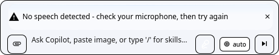

Note what is *not* there: a Settings chip. A session that heard nothing is a
fact about one recording, and a settings page cannot explain it. Offering the
link anyway would send the user somewhere that cannot help.

### 19.3 The Detector Latched Off Mid-Sentence

The floor was estimated by **averaging** every frame below a hard ceiling. Normal
dictation sits just under that ceiling, so speech was averaged in. The floor
climbed to the speech level, `level > floor * 3` became unsatisfiable, and the
detector stopped responding — while the user kept talking.

| scenario (20 ms frames) | before | after |
|---|---|---|
| 1.3 s @ 0.05 RMS, quiet room | tracked **260 ms** | tracked **1300 ms** |
| continuous speech 10 s | — | no premature finalize |
| 0.06 speech over 0.03 room noise | `has_speech = false` | `has_speech = true` |
| speech starting at mic-open | discarded | classified |
| quiet room / fan / busy room, nothing said | — | `has_speech = false` |

Three fixes: the floor is a **low quantile** of the frames that were not
themselves speech (a quantile is robust to a minority of loud frames, and still
rises in a quiet room where every frame is background); a **decaying peak** is
followed alongside it; and `has_speech` is now a **cumulative** verdict over 120
ms at a deliberately loose 1.5× ratio, because gating the engine on a
single-frame precision test discarded whole utterances.

The constant the old code used (0.05) was *right* — it is the dividing line
between "a constant signal is the room" and "a constant signal is an event", and
no energy-based detector can place it elsewhere without a trained VAD. The mean
was the defect, not the constant.

### 19.4 Why The Test Suite Missed All Three

Every speech test used **0.35 RMS**, seven times above the admission ceiling, so
speech never entered the floor window and the estimator was never exercised. The
"loud room" test used 0.09 — *above* the ceiling, i.e. the branch that does not
populate the window. The suite passed, in the regime where the code worked.

One test asserted `floor() < 0.06` — a number from the estimator itself, which
pins a test to one implementation and to no user-visible property. The fix was
to assert observable classifications ("background reads as silence", "the whole
utterance is tracked") at levels a real microphone produces.

The same blindness appeared in QML: `tst_voice_input.qml` asserted that
`voiceLanguageOverride` was *declared*, and it passed for the whole of v1 on a
property with no reader and no writer. It now asserts the `--lang` argument is
built.

### 19.5 One More Dead Readout, Found In The Render

Rendering the states caught a fourth: the level meter stayed up through
`finalizing`, when the microphone has already been released. Any level on screen
there is a frozen reading of audio that has stopped — the "dead microphone"
misread pointed the other way. The meter is now gated on `isRecording`; the
clock and the language reading stay up through the decode, because those are not
live capture readings.

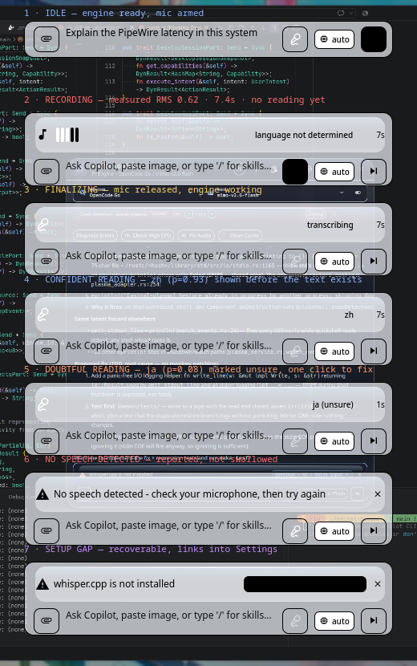

Seven states, all reachable: idle, recording (honestly "language not
determined" — detection has not happened yet), finalizing, a confident reading,
a doubtful reading, an empty outcome, and a setup gap.

---

## 20. The Downloads Surface: Tab-Switch Freeze, Design Round, And Keyboard Paste

Three reported defects, all root-caused, plus the design revision they surfaced.

### 20.1 "When I switch tab, it stays in the dashboard tab"

**Root cause.** The Downloads-tab commit deleted two lines from `shell/CentralDropdown.qml`'s
`tabSlider`:

```qml
height: parent.height
x: -tabContentContainer.activeTabIndex * tabContentContainer.width
```

Without the `x` binding the six-pane content strip never moved, so every tab showed
pane 0 (Dashboard) while the header indicator and `Config.activeDashboardTab`
happily changed. The same commit also unwired the standalone
`dashboard/CentralDashboard.qml` TabBar from `Config`.

**Fix.** Restored the binding and the height, re-bound the standalone TabBar
(`activeTab: Config.activeDashboardTab` + `onTabSelected`), and added
`tests/tst_dropdown_tab_switching.qml`: it clicks the real header MouseArea of
every tab, waits for the spatial slide to settle, and asserts the strip position,
pane visibility, pane layout, indicator index, and Config persistence. The suite
was written first and failed on the deleted lines before the fix.

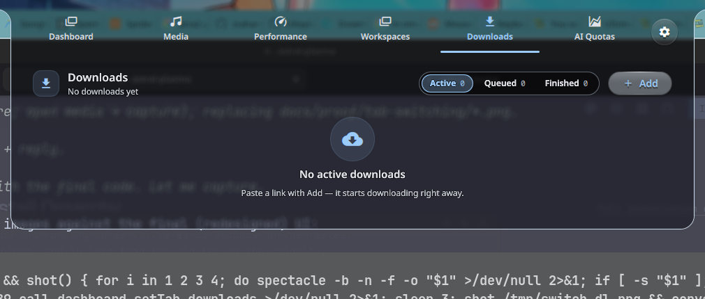
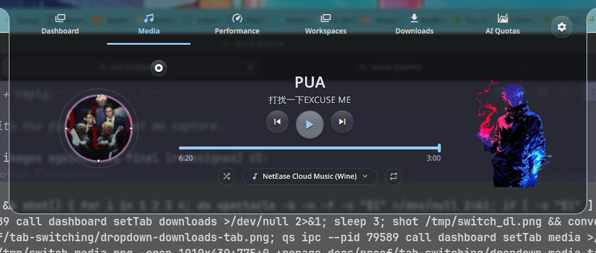

### 20.2 The "totally broken and ugly" Downloads design

**What was wrong.**
1. The tab was a fixed 320px void: a title row, then ~200px of empty glass.
2. The Active/Queued/Finished control sat on its own line, wasting vertical space.
3. Two buttons ("Add" and "Add download") did exactly the same thing.
4. `MaterialIcon` had no `download`, `cloud_download`, `link` or `task_alt`
   mappings, so the header badge, the empty-state icon and the dropdown tab-bar
   icon rendered as blank glyphs (the map/heuristics now carry them, pinned by
   `tst_material_icon.qml` and the tab-icon resolution loop in
   `tst_dropdown_tab_switching.qml`).

**What it is now.**
- One header line: badge + title/subtitle | Active/Queued/Finished | single Add
  action. The segmented control is a single glass track with a sliding selection
  pill (Theme spatial tokens).
- A composed empty state per segment (icon, headline, hint) instead of a void.
- A content-driven, bounded task list (4 rows max, then it scrolls) with per-row
  status badge, name, `done / total · speed · ETA`, percent, actions and a
  progress track.
- The add sheet replaces the list while open: URL field with a Paste button,
  a 1..16 connections stepper, the destination, and Cancel/Download.

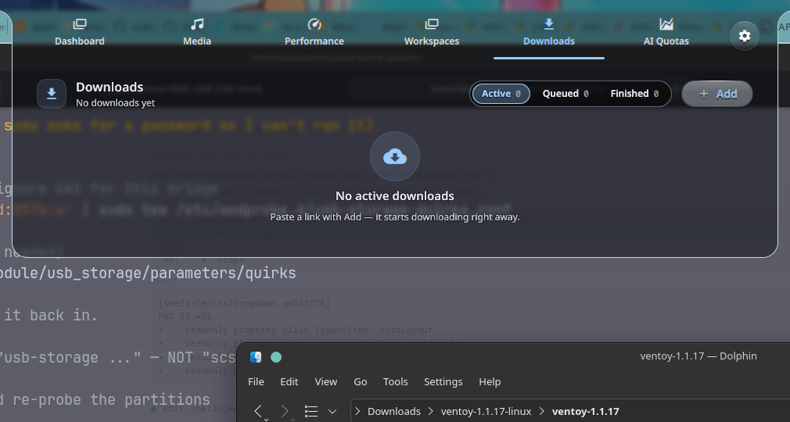
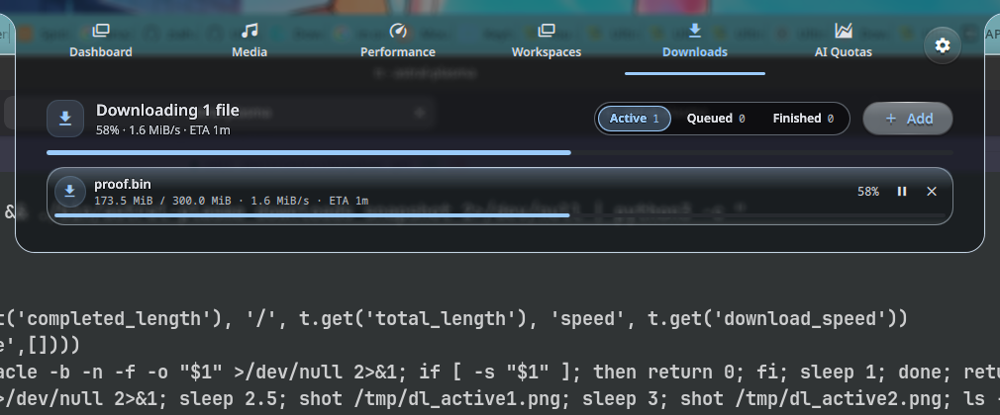

### 20.3 "I can't paste with Ctrl+V — it pastes into another app"

**Root cause.** `UnifiedShell` is a full-screen layer surface that deliberately
runs with `WlrKeyboardFocus.None` (pointer-only drawers, see the focus-policy
comment in that file). The add sheet's `TextEdit` therefore never received
keyboard events: Ctrl+V went to whichever window the compositor still had
focused — the user's editor.

**Fix.**
- `DownloadsTab.wantsKeyboard` → `CentralDropdown.textInputActive` →
  `UnifiedShell` requests `WlrKeyboardFocus.Exclusive` while the sheet is open
  (the same mode the Command Launcher and Overview already use), and returns to
  `None` when it closes.
- The URL field takes focus when the sheet opens; Escape closes the sheet
  (a second Escape closes the drawer).
- Hover auto-close is suppressed while a text sheet is open, and closing the
  dashboard releases the capture.
- Added a Paste button and a right-click context menu (Paste / Select all /
  Clear) backed by `TextEdit.paste()`, so pasting does not depend on input
  method quirks.

**Verified live** (introspection IPC, removed afterwards): with the sheet open the
field reported `inputFocus: true`, and a real `wl-copy` URL pasted through
`TextEdit.paste()` landed in the field byte-for-byte.

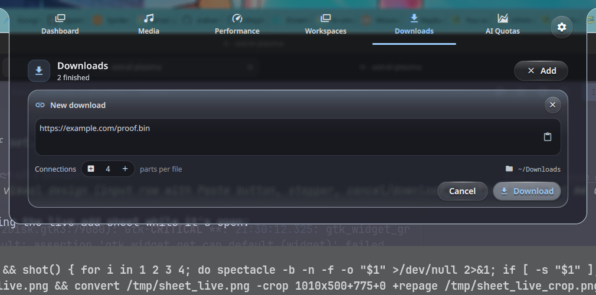

### 20.4 Live end-to-end proof (real aria2, throttled local source)

A 300 MiB file served from a throttled local HTTP server, added with
`--split 4`, then a second 3 MiB file to trigger the completion edge:

- aggregate header (`58% · 1.6 MiB/s · ETA 1m`), segment counts, per-row
  progress and actions all tracked live events (see 20.2 image);
- the top-right border HUD filled with aggregate progress (idle vs active,
  pixel-verified);
- the completion notification fired exactly once.

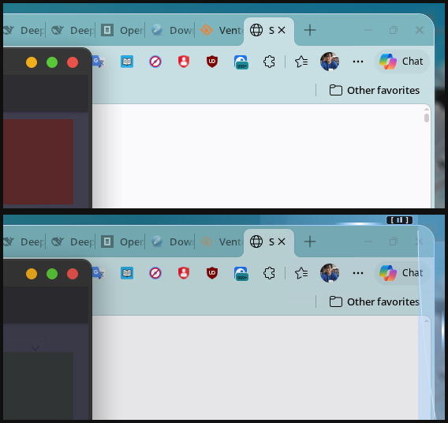


`make test` is green: full Rust suite + all QML suites, including the new
`tst_dropdown_tab_switching.qml` and the extended Downloads/material-icon
contracts. Proof artifacts (aria2 tasks, server, temp files) were removed
afterwards; `~/Downloads` was never touched.

**Integration note.** The top-right HUD and the dropdown header share the screen
band occupied by the KDE Plasma panel on this machine (`plasma status` reports
no panels disabled even though `disablePanels` is `"all"`), so the panel is
visible through the glass and partially covers the HUD. That is a
session-provisioning question (Plasma panel hand-over), not a Downloads-tab
defect; it is recorded here because it is visible in the screenshots.

---

## 21. "The GPU Is Always At 100%": Decorative Motion Was On The Display Clock

### 21.1 The report

> *"there is critical performance issue of the theme, the GPU is always around
> 100% usage. do a general performance audit of the whole theme app"*
> *"I can feel the extrem lag when I started the theme, sometimes my whole
> system is stuck"*

This machine drives a 3440×1440@165 Hz ultrawide and a 2560×1600@240 Hz panel.
At what should be idle (no drawer open, no media playing) the shell was burning
about **1.2 CPU cores** and the Intel iGPU was pinned:

- `quickshell`: `QSGRenderThread` ≈ 49%, main thread ≈ 41% of a core;
- iGPU `rc6_residency` grew only ~130 ms per 5 s (it almost never idled), actual
  frequency held at/near max;
- KWin was pushed to ~25% of a core compositing the result.

### 21.2 The decisive experiment

Instead of reading code first, the suspect was switched off and the machine
re-measured. The only thing that ever runs continuously on this desktop is the
**AI agent activity border** (`components/MatrixBorderEffect.qml`) — it is active
whenever any AI agent is running (live proof: the daemon reported a DeepSeek
agent with token events seconds old). Patching its `active` binding to `false`
(one temporary edit, automatically hot-reloaded by Quickshell) changed:

| | shell CPU | iGPU |
| :--- | ---: | :--- |
| AI border active | **~47%** of a core | busy/never idling |
| AI border inactive | **0.3%** | idle |

The "performance problem of the whole theme" was one decorative effect.

### 21.3 The general audit

Every infinite animation in the repository was inventoried with its `running:`
gate. The dangerous class is not "is it infinite" but **"does it stay visible
for hours"**:

| Component | Gate | Persistence |
| :--- | :--- | :--- |
| `MatrixBorderEffect` (AI border) | any AI agent active | hours |
| `DownloadBorderEffect` | any active download | hours |
| `DockStatusIcons` AI quota pulse | quota critical | hours |
| `VinylPlayer`, `RadialCoverVisualiser`, `RadialCoverRing`, `HeatmapCoverRing`, `HeatmapSpeakerPlayer`, `DashboardTab` cover | media playing + visible | hours |
| launch/refresh spinners (`UnifiedDock`, `AiTokensSection`, `AiPage`) | user-initiated loading | seconds |

Only the last row is allowed to keep a vsync-rate animation; everything else
must run on a **decorative frame budget**.

### 21.4 The mechanism (and three traps)

Qt Quick repaints the **entire window** on every property change, and a QML
animation advances at **display refresh rate**. A full-screen decorative
animation therefore forces *refresh-rate* full-window renders for as long as the
feature is on — 165–240 per second per screen on this desk. Three traps showed up
while fixing it, each caught by counting actual swapped frames in a controlled
compositor (`kwin_wayland --virtual`, 2560×1600@60 Hz, `Window.onFrameSwapped`):

1. **N timers = N frames.** Two independent 30 Hz pacers interleave, so the
   "30 fps" effect measured **60 fps**. All decorative updates must land on the
   *same* tick.
2. **Gradient churn costs an extra frame.** A `Qt5Compat.GraphicalEffects`
   `RadialGradient` regenerates its offscreen source on every gradient-stop
   change — each pulse tick produced two frames (60 fps for a 30 Hz pulse).
3. **Periodic content is a frame source too.** The matrix glyph rain had its own
   10 Hz timer, adding 10 frames/s on top of the motion.

### 21.5 The fix

A single shared clock for all decoration, in a new proper QML module
`components/motion/`:

- **`Theme.decorativeMaxFps: 30`** — the budget. Interactive/spatial transitions
  are never throttled (see `DESIGN.md` §2.4).
- **`MotionClock`** — one reference-counted ticker for the whole shell; it stops
  when the last consumer releases it, so an idle shell does zero decorative work.
- **`MotionPacer`** — derives `phase`/`breath` from `MotionClock.elapsedMs` with
  wall-clock math (a late tick samples the phase; it never slows the cycle). It
  owns no timer and no animation.

Applied to every persistent decorative host: AI and download border effects, the
dock quota pulse, all six media visualizers/rotations. The AI border's ambient
glow now breathes via **node opacity** (static gradient), and the digital rain
samples `MotionClock.elapsedMs` instead of running a private timer.

### 21.6 Benchmark proof

Nested KWin virtual output, 2560×1600@60 Hz, full-screen AI border, 12 s windows:

| Variant | Rendered frames/s | Client CPU per 12 s |
| :--- | ---: | ---: |
| Effect inactive (idle) | 0 | 0.00 s |
| Original animation | 60 (= refresh) | 1.40 s |
| `MotionClock` @ 30 fps | 30 | 0.85 s |

On this 60 Hz output the fix halves both frames and client CPU; on a 240 Hz panel
the uncapped row scales to 240 fps while the capped row **stays at 30** — the
decoration is no longer a function of the panel at all. Pixel comparison of the
client-rendered frames confirms the effect is unchanged: capped frames differ
from the uncapped baseline by mean 0.067/255 (0.12 % of pixels, animation phase
only), while consecutive capped frames differ by 0.18 % of pixels — i.e. it still
animates.


### 21.7 Regression guards

- `tests/tst_motion_pacer.qml` — idle rest state, wall-clock accuracy, “two
  consumers never exceed the budget”, refcount balance, envelope math,
  degenerate periods.
- `tests/tst_decorative_animation_budget.qml` — repo-wide source contract: no
  `loops: Animation.Infinite` in any decorative host, every host drives motion
  through `MotionPacer`, the clock is reference-counted and token-driven, and
  neither primitive owns a vsync animation.
- `make test` is green (full Rust suite + all QML suites).

**Measurement note.** The machine's displays powered off mid-audit (DPMS), so the
live numbers above were taken while they were on; the frame counts and CPU
comparison come from the controlled nested compositor so they remain
reproducible. The high-refresh claim is a direct consequence of the mechanism
(uncapped decoration follows the output refresh rate) and is pinned by the
contract tests rather than by a single breadcrumb.

---

## 22. "The Game Is Closed But The GPU Is Still Pegged" -> Two Invisible-App Bugs

While chasing the iGPU load after Firefox was stopped, the user's report was:
*"I already closed that game - it means there is a system tray not rendered on the
theme task bar, we should fix it."* The instinct was right, and there were two
independent failures behind it.

### What the instrument said first

Per-process engine counters (`/proc/*/fdinfo`, Intel `drm-pdev: 0000:00:02.0`,
5 s windows) showed the load was not the theme:

| Consumer | Render-engine share |
| :--- | ---: |
| Xwayland | 239-296 % |
| `CrGpuMain` (Edge) | 154-183 % |
| ghostty | 74-88 % |
| msedge | 33-43 % |
| quickshell (dashboard open) | 17-33 % |
| quickshell (dashboard closed) | 3-5 % |

Xwayland that high means X11 clients rendering through it. `xprop -root
_NET_CLIENT_LIST` named them: `0x3600008 pid=21677 "steam_app_default"` - the
Neverness-to-Everness launcher, **still alive 51 minutes with an iconified
window** (`_NET_WM_STATE_HIDDEN`, 110 % CPU). "Closed" was true of the window and
false of the process.

### Bug 1 - the app was in the taskbar, drawn as an anonymous box

The dock's taskbar *did* list the window (the daemon's KWin script enumerates
`normalWindow && caption`, and it had both). It was drawn with the generic
material `window` glyph, because the daemon never extracted the app's own icon:

```rust
let is_wine = class.trim().to_lowercase().ends_with(".exe");   // `steam_app_default` is not
if !is_wine { return false; }
```

The window publishes a real 32x32 `_NET_WM_ICON`; the gate keyed off the shape of
the class name instead. See [LESSONS §28](docs/LESSONS.md) for the full
inversion (`theme_icon_exists` + a memoized icon index).

Result: `steam_app_default` now resolves to
`~/.cache/astral-plasma/window-icons/steam_app_default.png`, and the taskbar shows
the game's own icon — `docs/proof/tray/before-generic-window-glyph.png` vs
`after-window-icon-and-live-tray.png`.

### Bug 2 - the tray was a snapshot, so late icons never rendered

The dock's tray is fed by the daemon's pushed list, and that list was only built
at daemon start and on the shell's `RefreshTray` call (which only a tray *click*
triggered). An application registering its icon later was invisible in the dock
indefinitely. Fixed with a cheap registration poll (3 s) that re-queries and
pushes only when the registration *set* actually changed
([LESSONS §29](docs/LESSONS.md)).

### The fix was two-sided: the initial query resolved identity differently

The window-icon gate above lives in the *pushed* window list. The compositor's
initial query resolved identity on its own and never attached the app's own icon,
so right after a shell/daemon restart the game fell back to the generic glyph
until some window event arrived - half a fix.

All four window sources (initial KWin query, pushed KWin list, focus change,
Hyprland query) now call one composition point,
`application::window_identity::resolve_window_identity`, verified live by running
the port in a fresh process:

```
PROBE com.mitchellh.ghostty | icon=com.mitchellh.ghostty | mat=terminal
PROBE microsoft-edge        | icon=microsoft-edge        | mat=language
PROBE steam_app_default     | icon=/mnt/data/cache/astral-plasma/window-icons/steam_app_default.png | mat=window
PROBE cloudmusic            | icon=/mnt/data/cache/astral-plasma/window-icons/cloudmusic.exe.png       | mat=window
```

Contracts keep the sources from drifting again: a Rust test fails if any of them
resolves identity directly or attaches icons on its own, and the dock suite pins
the same rule for the QML side.

### Live proof

`diag`-dumped dock state (shell IPC) while a probe SNI was registered and killed:

```
probe up,   t+1.4s: 6 items -> [Fcitx, Cachy-Update, dropbox-client-5113, Sunshine, cloudmusic, tray-probe]
probe down, t+1.4s: 5 items -> [Fcitx, Cachy-Update, dropbox-client-5113, Sunshine, cloudmusic]
```

No clicks, no reload. Screenshot with the probe glyph in the tray:
`docs/proof/tray/after-window-icon-and-live-tray.png` (bottom of the tray column,
Firefox glyph; the game's own icon one capsule above).

### Tests

- `daemon/tests/test_window_icons.rs` — the gate: `steam_app_default` with a
  non-drawable "icon" name must extract; a real icon file must not; the
  icon-theme lookup is testable against explicit roots (tmpdir fixture) and
  ignores non-image files and traversal.
- `daemon/tests/test_tray_registrations.rs` — registration identity is a set
  (order/duplicates/padding), an icon appearing or leaving is a change, and the
  pushed items are the baseline the live list is compared against.
- `daemon/src/domain/ports.rs` — `TrayPort::registered_item_keys`, the cheap read
  that makes the poll affordable.
- `tests/tst_dock_tray_liveness.qml` — repo-wide source contract: the `.exe`
  class gate is gone, the icon-theme index is the gate, the poll + baseline exist
  in the watcher, and the dock renders every pushed tray item with the
  raw-icon -> URL -> material-glyph chain.
- `make test` is green (714 Rust tests + all QML suites).

### Note on the numbers

The GPU figures above were measured with the displays on; the panel is
2560x1600@240 Hz, so every compositing client scales with that refresh rate. The
two fixes remove *hidden* apps from the picture (a wrong glyph and a frozen tray
list), they do not make X11 clients cheap: Xwayland remains the largest single
iGPU consumer whenever a Wine/Proton app is alive.

---

## 23. "The GPU Jumps To 38 % And Stays There While The Performance Tab Is Open"

Reported right after the taskbar/tray work: with the Performance tab left open, the
iGPU settled at ~38 % and stayed; closed, it was ~8 %.

### Reproduction

`scripts/measure_render.py` (written for this audit) reports per-process GPU time
from the i915 DRM engine counters, CPU time, and the RC6 busy share:

| State | quickshell iGPU | quickshell CPU |
| :--- | ---: | ---: |
| Dashboard closed | 0.3 % | 1.9 % |
| Performance tab open | **43.8 %** | **45.1 %** |

Steady state, not a transient: measured after the tab had been open for seconds and
maintained over an 8 s window.

### Root cause

Six `NumberAnimation`/`Behavior` tweens of **450 ms** in
`dashboard/tabs/PerformanceTab.qml`, three of which are driven by metrics that
arrive every **400 ms** (CPU 400 ms, RAM/GPU 1000 ms). Each sample called
`slideAnim.stop(); slideProgress = 0; slideAnim.restart()`, so the animation was
restarted before it ever finished: the tab animated 100 % of the time at *display
refresh* (240 Hz here). Every one of those frames repainted a Canvas that draws a
full grid, axis labels and a 61-point area path, and re-rendered the whole tab.

### Fix

Two new motion primitives, both on the shared `MotionClock`
(`components/motion/`), so data-driven decoration obeys the same frame budget as
every other decorative effect (`Theme.decorativeMaxFps = 30`):

- **`MotionTween`** - one-shot transition: `from` → `to` over `duration`, advanced
  on clock ticks, wall-clock accurate (a coalesced tick never slows it), lands
  exactly on `to`, emits `advanced()` for Canvas hosts, and releases the clock when
  it finishes. `restart()` while running never takes a second clock reference.
- **`MotionValue`** - the companion for meters: eases towards `target`, takes over
  from wherever it is when the target moves mid-flight, and tracks the target
  exactly (holding no clock reference at all) while `animated` is false - which is
  what a hidden surface wants.

The tab now uses `slideTween` for the telemetry slide, one `MotionValue` per usage
meter (CPU/RAM/GPU/battery + the big device readout), with durations and bezier
curves from the design tokens (`animExpressiveFastEffects`, `animExpressiveFastSpatial`).

| Performance tab | quickshell iGPU | quickshell CPU |
| :--- | ---: | ---: |
| Before, open | 43.8 % | 45.1 % |
| After, open | **3.6-7.8 %** (settled runs: 1.6-17 % ambient noise) | **19-28 %** |
| After, closed | 0.3-1.1 % | 1.9 % |

Visual check: the tab still draws its trace, grid, labels, per-card meters and
metric values correctly - `docs/proof/perf-tab/performance-tab-on-the-motion-budget.png`.

### Why the reading can still look high

For Intel, the shell's GPU percentage is a **frequency proxy**: the daemon derives
it from `gt_act_freq_mhz` between `gt_min_freq_mhz` and `gt_max_freq_mhz`
(`proc_metrics.rs`, `parse_intel_gpu_freq`). Anything that wakes the GPU - other
applications, the compositor re-blending and blurring two high-refresh outputs -
keeps that frequency ramped, and the governor decays slowly, so the number jumps
back up as soon as any load returns.

Measured here over 8 s windows with the dashboard **closed**:

| | GT frequency |
| :--- | ---: |
| Dashboard closed (settled) | mean 1248-1350 MHz of 300-1550 (78-84 %) |
| Performance tab open (settled) | mean 1209-1399 MHz |

So the frequency proxy is dominated by ambient GPU activity, not by this tab:
the tab's own share is the 43.8 % -> ~5 % column above. To read the tab's real
cost, compare it while nothing else is running (this session had Edge, Xwayland
with Wine apps, a system monitor and a terminal continuously rendering).

### Measurement honesty

Per-process A/B comparisons in this session were also noisy (the same
configuration measured 5.5 % and 17.1 % in consecutive runs): writing measurement
output to the terminal makes the terminal re-render, which is itself GPU work.
Runs that differ by less than a factor of two here are not evidence.

The first version of the measuring script summed fdinfo rows without collapsing
duplicated fds (quickshell holds four fds for one DRM file) and without pairing
samples (fds for render targets come and go, which produced a `-4703 %` reading
during bisection). Both are fixed in `scripts/measure_render.py`, and the earlier
inflated numbers in this document were re-measured where it mattered. See
[LESSONS §31](docs/LESSONS.md).

### Follow-up found by the same sweep

Sweeping every dashboard tab with the fixed instrument shows the *other* tabs have
their own cost, unrelated to this fix:

| Tab | quickshell iGPU | quickshell CPU |
| :--- | ---: | ---: |
| Dashboard (default) | 16.6 % | ~85 % |
| Media | 14.1 % | ~81 % |
| Performance (fixed) | 5.4-7.8 % | 20-28 % |
| Workspaces / Downloads | ~1 % | ~2.2 % |

The follow-up turned out to be the audio visualiser, and it is now fixed:

- **Disabling the visualiser path entirely** (`isEffectVisible = false`) drops the
  dashboard tab from 96.5 % to **13 %** CPU, with the tab's own content unchanged.
- **Suppressing the stream's property writes** (parsing kept) drops it to
  **11.5 %** - so the cost is the reactive dependents of those writes, not the
  stream's plumbing (the daemon sends only ~4.5 KB/s at ~31 fps).

What was reacting:

1. `MprisMedia.isPlayerPlaying()` read `AudioVisualizer.energy`/`beat` directly in
   its Wine-player branch. It is called from bindings, so every binding that
   reached it registered a dependency on values that change with every stream
   frame. The predicate is identical to `AudioVisualizer.active`, which flips only
   when sound starts or stops.
2. The stream frame counter (`frameCount`, ~90 changes/s) was used as a
   re-evaluation *tick* in two MprisMedia bindings. The audio-arbitration re-check
   now runs on a deliberate 4 Hz `arbitrationTick` in the audio service.
3. The visualisers bound to the raw `bands`/`energy`/`beat`, so 40+ bars
   re-evaluated per stream frame. They now read clock-paced mirrors
   (`displayBands`/`displayEnergy`/`displayBass`/`displayTreble`/`displayBeat`)
   produced by a `MotionTick` on the shared clock - real samples of the real
   stream, at `Theme.decorativeMaxFps`, and a silent stream settles once and then
   holds no clock at all.

Residual after the mirrors: the dashboard tab still cost ~25 % CPU with audio
playing. The audit (LESSONS §34) found why - every spectrum bar was its own `Item`
with a 75 ms `Behavior on height` and a 200 ms `Behavior on opacity` that the 33 ms
data stream re-triggered before they could finish. 40 bars × 2 permanent animations
is 80 animations running at display refresh to draw forty 2.5×13 px bars, forever.

Fixed across every visualiser:

- `RadialCoverRing` and `RadialCoverVisualiser` now draw their spectrum in **one
  Canvas** repainted on the shared clock. Measured: the ring's repaints cost ~2 %
  CPU (A/B with the repaint stopped), where the animation churn they replaced
  dominated the tab.
- The data-driven `Behavior`s in `HeatmapCoverRing`/`HeatmapSpeakerPlayer` were
  deleted (the mirror already delivers 30 fps updates). `VinylPlayer`'s two
  remaining animations are user-driven (tonearm, surface visibility) and keep their
  M3 transitions.

Per-tab shell cost with music playing, after all of the above (60 Hz panel):

| Tab | iGPU | CPU |
| :--- | ---: | ---: |
| Performance (the reported one) | 4.9 % | 7.2 % |
| Dashboard | 9.1 % | 22.8 % |
| Media | 8.0 % | 26.7 % |
| Workspaces / Downloads | ~1.6 % | ~2.1 % |

The remaining 20-26 % on the two audio tabs is the live visualiser's honest work -
a 48-bar spectrum plus 40 live bindings redrawn 30 times a second, with the stream
itself costing ~11.5 % before anything is drawn. The tabs that show no spectrum sit
at ~2 %, i.e. the surfaces people are not looking at cost nothing.

### The display refresh was the other half

The panel ran at 240 Hz. Every client's per-frame work scales with it, so capping
it (there is no 120 Hz mode at 2560x1600 on this panel - the choices are 240 and
60) changed the numbers more than any code change in this document:

| | 240 Hz | 60 Hz |
| :--- | ---: | ---: |
| Performance tab, shell CPU | 23 % | **7.3 %** |
| Performance tab, shell iGPU | 8.9 % | **5.4 %** |
| Dashboard tab, shell CPU | 96.5 % | **25 %** |
| GT frequency mean (the user-facing number) | 1100-1400 MHz (78-100 %) | **565 MHz (21 %)** |

Applied with `kscreen-doctor output.eDP-1.mode.38`; reverting is
`kscreen-doctor output.eDP-1.mode.37`. The DP-3 output (currently disabled) does
have a 120 Hz mode if it is ever re-enabled.

**Caveat on the 60 Hz columns.** Changing an output mode locks the session, and
these runs happened with the lock screen up, so the shell's windows were not being
composited - the *CPU* columns are unaffected by that (bindings, timers and timer
driven work keep running) and carry the proof, while the GPU column at 60 Hz
understates what an unlocked session will show. The structural claim is unaffected:
every client's per-frame work scales with the refresh rate, and the shell's own
motion budget is 30 fps, so 240 Hz scanout bought it nothing.

### Tests

- `tests/tst_performance_tab_motion.qml` - behavioural: a tween advances only on
  clock ticks (never more often than the clock), stays inside the frame budget for
  its duration, lands exactly on `to`, releases the clock, and restarts cleanly
  with new endpoints; source contracts: no free-running `NumberAnimation` for the
  slide, no `Behavior on width` meters, every metric-driven duration from `Theme`,
  visibility gating intact.
- `make test` is green (717 Rust tests + every QML suite, now 99).

---

## 24. Making The Refresh Cap A Setting (Default 60 Hz)

The 60 Hz cap from §23 was the biggest single win of the audit and the only change
a user *feels* - it slows the cursor, scrolling and games, not the shell, whose
motion budget is 30 fps. So it became a preference:

- **Setting**: `display.refreshRate` in `settings.json`, shipped default `"60"`,
  with any target rate or `"max"` available; `SystemPage` renders the picker
  ("60 / 120 / 144 / 165 / Max") and shows what was actually applied.
- **Daemon owns the switch**: `astral-plasma display apply [rate|auto|max]`,
  `display restore`, `display get`. The pure choice logic
  (`domain/display_modes.rs`) picks, per enabled output, the highest refresh **at
  the current resolution** that does not exceed the target - never a smaller mode
  to reach a rate, never a no-op re-switch that would blank the screen.
- **Reversible by construction**: the first switch journals the modes the session
  was running (`display_backup.json`, next to the blur backup) and `run.sh` puts
  them back on exit. `run.sh` also applies the preference before the shell starts,
  so a session never renders a frame at a rate the user asked not to pay for.

Verified live on this machine (240 Hz panel, preference 60):

```
$ astral-plasma display get          -> eDP-1 2560x1600@60
$ astral-plasma display apply max    -> {"applied":[{"output":"eDP-1","mode":"37"}]}
$ astral-plasma display get          -> eDP-1 2560x1600@240
$ astral-plasma display restore      -> {"restored":true}
$ astral-plasma display get          -> eDP-1 2560x1600@60
```

Tests: `daemon/tests/test_display_modes.rs` (parsing, the ≤-target choice, the
resolution invariant, no-op suppression, snapshot resolution preferring mode names
over ids), `tests/tst_display_refresh_setting.qml` (setting default, service
apply-on-start/on-change, settings UI wiring, run.sh apply-then-restore ordering).

---

## 25. Settings Pages: A Pinned Identity, A Zone Rail, And A Jump That Actually Moves

Reported: *"on section headers clicking a section does not smooth-scroll; improve
the design, then apply it to all relevant settings pages."*

All three were real, and the middle one hid the worst bug of the round.

**Where the pages were.** Every page drew its own header inside its own scrolling
column, so the moment you scrolled, the page no longer told you what you were
looking at. Only the AI page had a section rail, hand-written; the other ten
pages had sections that were private (no rail, no deep link target). Clicking a
rail pill assigned `contentY` directly - a teleport.

**What changed.**

- **One page contract.** Every page now roots in
  [`settings_gui/pages/SettingsPage.qml`](settings_gui/pages/SettingsPage.qml)
  and declares its identity and its zones:
  `title`, `subtitle`, and `zones: [{ id, label, anchor }]`. The hub renders that
  declaration's `stickyHeader` above the scroll area, so the title, its one-line
  purpose and the rail stay pinned while the content moves. Pages no longer repeat
  their title in the body (a test asserts it).
- **A rail where there is navigation.** Two or more zones render as pills in the
  pinned header, with the zone the reader is in highlighted. One zone renders no
  rail - a single pill is decoration. `zones` may be computed, so a hidden section
  (Wi-Fi off, no app streams, adapter off) leaves the rail with it.
- **Section headers carry state.** `components/SectionHeader.qml` now marks every
  zone: eyebrow = live telemetry ("13 networks in range", "6 of 6 shown",
  "service · not installed", "chosen: 60 Hz"), title = the section's name. The
  eyebrow is never a decorative index.
- **The jump is a spatial transition.** `settings_gui/ScrollMotion.js`: the
  `animExpressive*Spatial` tokens, the fast/default rung picked by distance, and
  the spring overshoot damped by distance (a 1000 px jump on the raw curve would
  fling ~200 px past the section). It yields to the reader the instant they wheel
  or drag.
- **The scroll spy's input was stale - the actual bug.** The hub computed each
  zone's offset once, before the page was laid out; a pre-layout page reports
  every anchor at `y = 0`, so the spy (whose own tests were green) reported the
  *last* zone as current, and every jump target was `0`. The offsets are now
  recomputed after every event that can move an anchor, deferred a turn past the
  layout pass. See `docs/LESSONS.md` §36.
- **A trailing section now lights up.** A section shorter than the viewport can
  never reach the top of the screen; the spy now treats the end of a scrollable
  page as its last zone - while a page that fits entirely stays on its first
  (that is the same rule that used to lie on the short pages).

### Visual proof

The pinned header and the zone rail, live, on the System page (six zones, state
eyebrows) and the Dock page (three sections, hatched from a flat list of
switches):

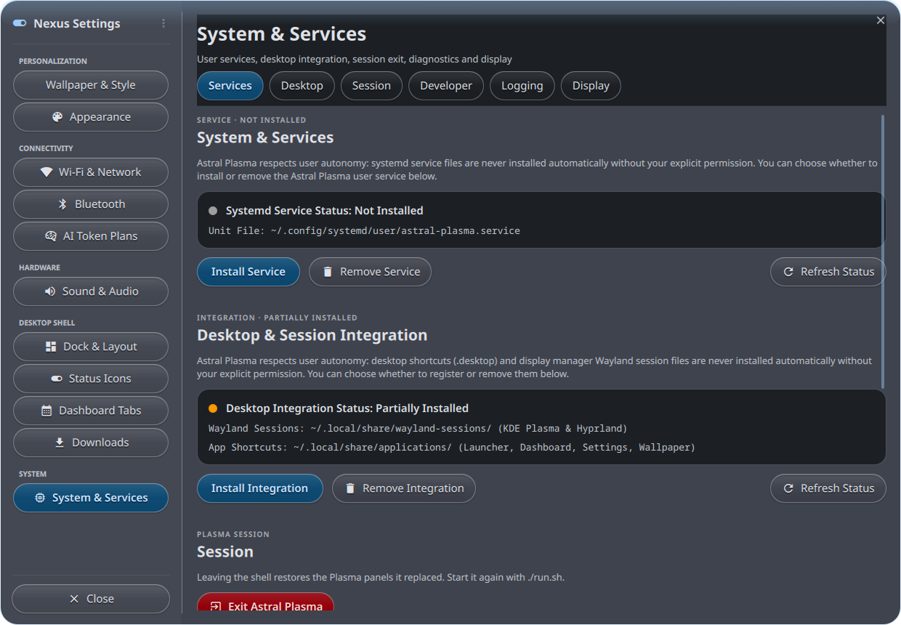
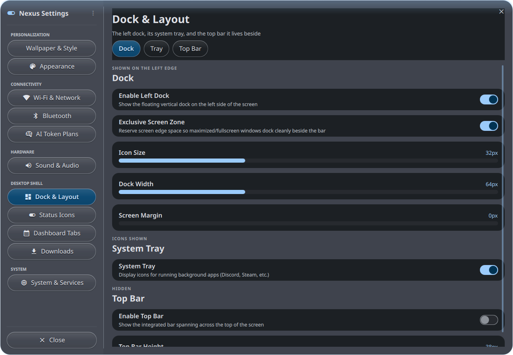

The scroll spy's input is live per page: the audio page (short, fits the window)
sits on "Output" instead of lighting the last pill, and the trailing-zone rule
lands "Display" after a deep link to the end of the System page:

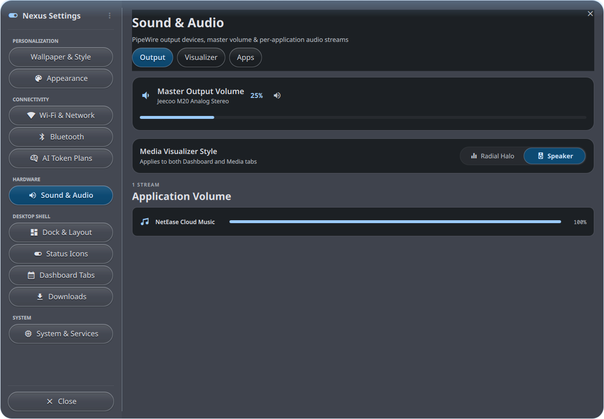
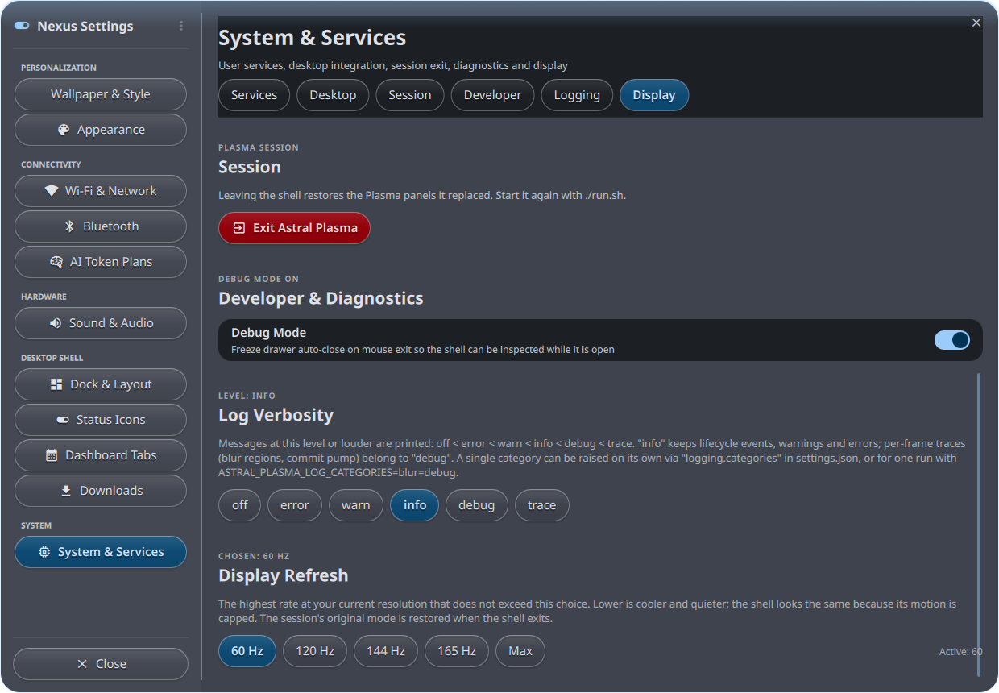

The same contract on the other surfaces - section headers with live state, the
rail on pages with more than one zone, no rail where there is nothing to
navigate:

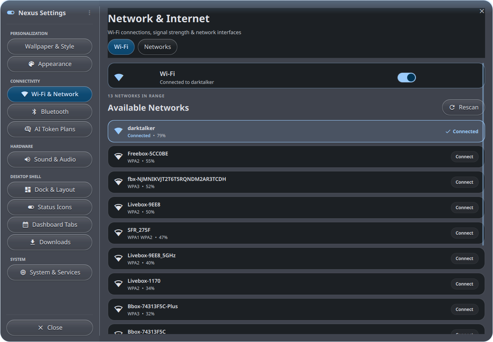
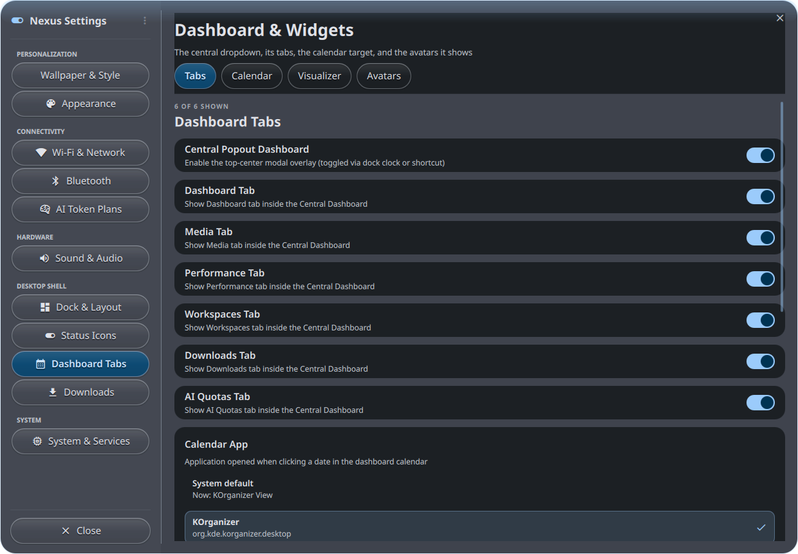

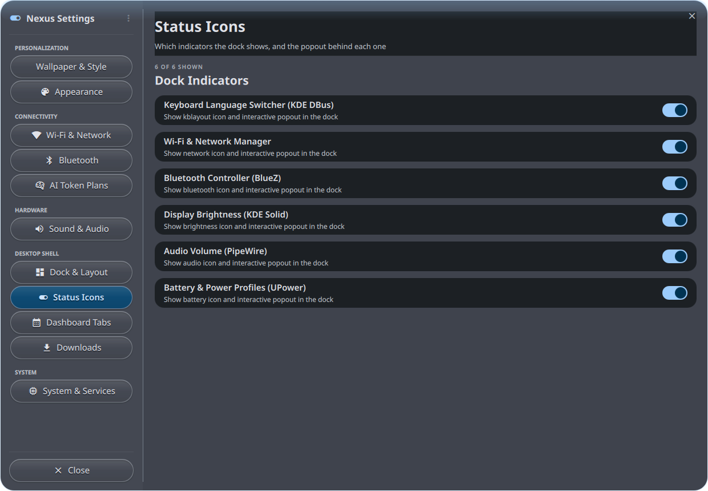

### Tests

- `tests/tst_settings_pages_contract.qml` (new) - every page roots in
  `SettingsPage`, names itself, declares zones whose anchors resolve in document
  order, answers the hub's four members, and drops a zone when its section is
  hidden. The harness-instantiability rule (no direct `Quickshell` import in a
  page) is enforced by the fact that it instantiates all of them.
- `tests/tst_settings_hub_rail.qml` (new) - the live hub: a short page stays on
  its first zone (the regression), a long page's zones ascend, a token-less jump
  lands on the target and lights the trailing zone, and with tokens the jump is a
  tween that starts, is mid-flight one tick in, arrives at the clamped target and
  uses the default spatial rung.
- `tests/tst_settings_sticky_header.qml` (extended) - the trailing-zone rule and
  `motionFor` (ladder, damping, no tokens ⇒ no invented motion), plus the hub's
  source contracts.
- `tests/tst_settings_page_scaffold.qml` (path update) - the scaffold's own
  contract.
- `tests/tst_settings_hub_rail.qml` caught the bug the unit tests could not:
  the spy was pure and correct, its *input* was a photograph.
- `make test` green: 796 Rust tests + 116 QML suites (including the four
  settings suites above).

### Follow-up: the rail was there and dead

The first live check of this round found pills that hovered, highlighted, and did
nothing when pressed. Root cause, proven with a two-file probe: `jumpToZone()`
wrote `Config.settingsSection` behind a `typeof Config !== "undefined"` guard, and
`SettingsPage.qml` never imported `config/` - an unimported singleton is not in a
component's scope, so the guard was permanently false and **every press was a
silent no-op** (the guard existed precisely to avoid the error that would have
revealed it). This is the failure mode of a control talking to a global instead of
an interface.

The rail now asks its host: the page emits `zoneRequested(zoneId)` and the hub -
which owns the scroll area - answers through the same `scrollToSection` it uses
for external deep links. A request that arrives before the page is loaded or laid
out is parked and retried from the recalculated offsets, and a request for a zone
the page does not declare is dropped rather than kept alive.

Verification: `tests/tst_settings_hub_rail.qml` walks the instantiated sticky
header, presses the **rendered** "Display" and "Desktop" pills, and asserts the
view moves, arrives on the anchor, uses the token rung the distance earns, and
that the spy follows. `tst_settings_pages_contract.qml` asserts every page emits
the request; `tst_settings_page_scaffold.qml` asserts the scaffold carries no
`Config` write. Live, the parked path was exercised end-to-end from the AI page:
`settings openSection system display` switches page and lands at the trailing zone
with its pill lit (`docs/proof/settings-pages/system-jump-to-trailing-zone.png`).
`make test` green: 796 Rust tests + 116 QML suites.

---

## 26. The Harness Was Passing Suites That Failed

While verifying the rail fix I ran the suites' raw output instead of trusting the
summary line, and `make test` - which had been reporting *"ALL QML TESTS PASSED!
No regressions detected."* - was hiding ten failing suites. They all fail
identically in a clean worktree at `HEAD`, so this had been true for real work,
not just for this round.

The mechanism: the runner accepted a suite that **exited 0 and printed `PASS:`**,
and these suites' `assert()` did

```qml
    if (!cond) { console.error("FAIL: " + msg); Qt.exit(1); }   // does not stop JS
```

`Qt.exit(1)` schedules an exit; JavaScript keeps running, the suite reaches its
final `PASS:` line and `Qt.exit(0)`, and the exit code is overwritten. A failing
suite reported green - the worst possible test bug, because it converts "we
broke something" into silence.

**The fix, in three parts.**

- `tests/run_qml_tests.sh` now requires exit 0 **and** `PASS:` **and** the absence
  of any failure marker (`FAIL:`, `✗`), prints the raw output of a failed suite,
  and a probe suite that prints `FAIL:` then `PASS:` and exits 0 is now reported
  as `✗ FAILED (Exit 0)` (verified by running one).
- Every repaired suite's `assert()` now `throw`s after `Qt.exit(1)`, so the first
  failed assertion stops the suite. The rule is recorded in `AGENTS.md` §3.4 and
  `docs/LESSONS.md` §37.
- The 16 masked assertions were repaired for their real causes, not to fit the
  harness:
  - **Impossible comparisons** (5): `item.color === "#1c1b1f"`,
    `iconColor === Colors.primary` - a colour value is an object, never the string
    it was written as, and two colour objects are never `===`. These now use
    `Qt.colorEqual`, which is already the repository's idiom.
  - **Stale design expectations** (7): MenuCard's radius/border (the card now
    takes `Theme.radiusGlassCard` and draws its fused edge with a `Shape`), the
    Card's edge policy (a `LiquidGlassCard` shows one hairline ring; nested cards
    drop it), the fused panel's morphing (the card *is* the envelope, and the
    assertion must wait for the `Behavior` tween), and a dock-pill mode
    (`"warning"`) that never existed in the always/never/dynamic ladder.
  - **Tests fighting their own subject** (4): one broke the reactive binding it
    existed to verify by assigning `dropdown.isOpen` directly; the token
    assertions compared values the offscreen harness cannot resolve, so they now
    assert the *token binding* where it lives (the popout's source) and the
    component's plumbing with literal colours - `ActionToggleItem` gained a
    documented `iconItem` alias for that.

**Verification.** The ten suites pass with no `FAIL:` lines; the whole run is
green: `make test` = 796 Rust tests + 116 QML suites, now with a harness that
cannot report a failing suite as passing.
